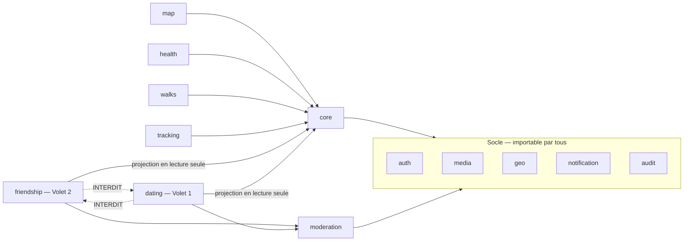
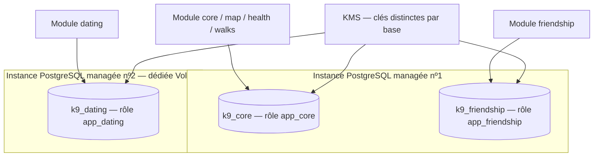
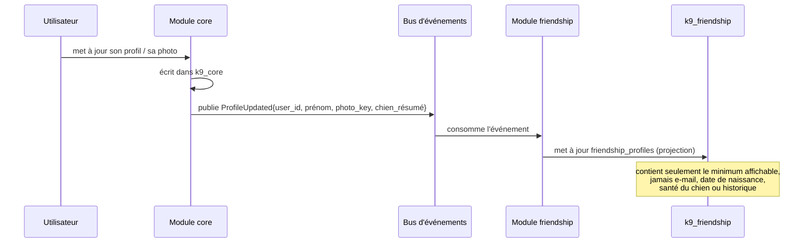
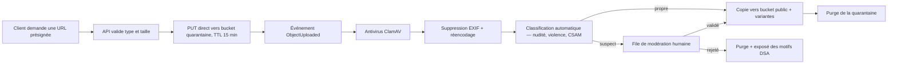

# K9 Global Solution — Architecture technique

> Répond à §6.2 du brief. Les choix marqués **[À VALIDER]** attendent votre arbitrage.

## 1. Choix de stack — recommandations et justifications

| Couche | Choix recommandé | Alternative écartée | Pourquoi |
|---|---|---|---|
| Mobile | **Flutter 3.x** (Dart) | React Native | Un seul codebase, rendu carte/GPS performant (`flutter_map` + tuiles vectorielles, `geolocator`), et surtout un seul pipeline de build à sécuriser. RN se justifierait uniquement si l'équipe est déjà React. |
| Backend | **NestJS (TypeScript), monolithe modulaire** | Microservices ; Django | Un module NestJS par domaine, frontières explicites, un seul déploiement. Les microservices multiplieraient par sept la surface d'attaque et le coût d'exploitation pour une charge inexistante au MVP. Django est excellent en géospatial mais nous coupe du partage de types avec un futur front web. |
| Accès aux données | **Drizzle ORM** + SQL typé pour le géospatial | Prisma ; TypeORM | Requêtes paramétrées par construction (protection injection), et contrôle SQL complet — indispensable pour PostGIS, que Prisma ne modélise pas nativement. |
| Base de données | **PostgreSQL 16 + PostGIS 3.4** | MongoDB | Géospatial, intégrité référentielle, chiffrement, et surtout la possibilité de séparer par bases distinctes avec rôles distincts, qui est le cœur de l'exigence d'isolation. |
| Cache / files | **Redis 7** (Valkey acceptable) | — | Sessions de rate limiting, files BullMQ pour notifications et modération asynchrone. |
| Stockage objets | **Scaleway Object Storage** (S3-compatible, fr-par) | AWS S3 | Souveraineté UE sans clause de transfert à documenter. URLs présignées courte durée. |
| Identité | **Keycloak** auto-hébergé UE | Auth0, Cognito | OIDC complet, MFA, rotation de refresh tokens, éprouvé. Évite d'écrire de l'authentification maison (première source de vulnérabilités) et évite un sous-traitant hors UE. |
| Push | FCM (Android) + APNs (iOS) | — | Aucune donnée personnelle dans les charges utiles de notification (voir §6). |
| Hébergement | **Scaleway, région fr-par** | OVH ; AWS Frankfurt | Managé PostgreSQL avec PostGIS, Serverless Containers, Secret Manager, entité européenne — pas de CLOUD Act à documenter. |
| Orchestration | **Serverless Containers / Kapsule managé** | Kubernetes auto-géré | **[À VALIDER — dépend de N1]** Avec une équipe de 1 à 3 personnes, Kubernetes auto-géré est un piège : il consomme le temps qui devrait aller à la sécurité applicative. |
| IaC | **Terraform** + état distant chiffré | Console web | Auditabilité des changements d'infra, exigée par le plan de sécurité. |
| Observabilité | Grafana Cloud UE ou Loki/Prometheus/Grafana auto-hébergés | Datadog | Coût et localisation des logs. Les logs contiennent des données personnelles : ils doivent rester en UE. |

## 2. Vue d'ensemble

```mermaid
flowchart TB
    subgraph client["Clients"]
        MOB["App Flutter — iOS / Android"]
        ADM["Back-office modération — web interne"]
    end

    subgraph edge["Périmètre"]
        WAF["WAF + CDN + TLS 1.3"]
        GW["API Gateway — rate limiting, JWT, CORS"]
    end

    subgraph identity["Identité"]
        KC["Keycloak — OIDC, MFA, refresh rotatif"]
    end

    subgraph api["API NestJS — monolithe modulaire"]
        CORE["core — user, dog, consent, RGPD"]
        MAP["map — lieux, avis"]
        HEALTH["health — carnet de santé"]
        WALK["walks — Volet 3 + événements"]
        TRACK["tracking — sessions GPS"]
        TRAIN["training — programmes"]
        BOOK["booking — hébergement, véhicule"]
        AID["firstaid — guide, vétérinaires"]
        MOD["moderation — signalements, DSA"]
        FRIEND["friendship — Volet 2, ISOLÉ"]
        DATE["dating — Volet 1, ISOLÉ"]
    end

    subgraph workers["Traitements asynchrones"]
        MEDIA["Pipeline média — AV, EXIF, classification"]
        NOTIF["Notifications"]
        RETEN["Rétention et purge"]
    end

    subgraph data["Données"]
        PGCORE[("PostgreSQL k9_core + PostGIS")]
        PGFR[("PostgreSQL k9_friendship")]
        PGDT[("PostgreSQL k9_dating — instance séparée")]
        REDIS[("Redis")]
        S3OK[("Object Storage — public")]
        S3Q[("Object Storage — quarantaine")]
    end

    subgraph ext["Sous-traitants"]
        IDV["Vérification d'identité — Veriff / Yoti / itsme"]
        PSP["PSP certifié PCI-DSS"]
        PUSH["FCM / APNs"]
    end

    MOB --> WAF --> GW
    ADM --> WAF
    GW --> KC
    GW --> api
    CORE --> PGCORE
    MAP --> PGCORE
    HEALTH --> PGCORE
    WALK --> PGCORE
    TRACK --> PGCORE
    TRAIN --> PGCORE
    BOOK --> PGCORE
    AID --> PGCORE
    MOD --> PGCORE
    FRIEND --> PGFR
    DATE --> PGDT
    DATE --> IDV
    BOOK --> PSP
    api --> REDIS
    api --> S3Q
    MEDIA --> S3Q
    MEDIA --> S3OK
    NOTIF --> PUSH
    RETEN --> PGCORE
```

Points à noter sur ce schéma :

- `FRIEND` et `DATE` ne pointent que vers leur propre base. Il n'existe aucune flèche entre
  `PGFR` et `PGDT`, ni entre l'un des deux et `PGCORE` : c'est une contrainte de moteur, pas
  une convention de code (voir §4).
- Tout média passe par la quarantaine avant publication. Aucun client n'écrit dans le bucket
  public.
- Le back-office de modération est un client séparé, sur un domaine séparé, avec MFA
  obligatoire et accès réseau restreint.

## 3. Découpage en modules — frontières et dépendances autorisées

Le monolithe modulaire ne tient que si les frontières sont vérifiées automatiquement. Chaque
module NestJS expose une **façade** (un service public) et garde ses entités privées. Un
module n'importe jamais un dépôt de données d'un autre module.

**Règles de dépendance, vérifiées en CI** (ticket ARCH-03 du backlog) :

1. `friendship` et `dating` ne s'importent jamais l'un l'autre, ni directement ni
   transitivement. Un test d'architecture (`dependency-cruiser` ou équivalent) casse le build
   en cas de violation.
2. Aucun code de sélection de candidats, de scoring, de gestion de like/match ou de
   messagerie n'est mutualisé entre `friendship` et `dating`. La duplication est ici
   **voulue et documentée** : c'est le prix de la garantie d'étanchéité. Un correctif appliqué
   à l'un doit être appliqué à l'autre manuellement, et la revue le vérifie.
3. `friendship` et `dating` accèdent aux données de `core` uniquement par la projection
   décrite en §5 — jamais par une jointure SQL.
4. Le socle partagé (`auth`, `media`, `geo`, `notification`, `audit`) est autorisé parce qu'il
   ne contient aucune donnée de mise en relation : il ne fournit que des primitives.

## 4. Isolation des trois volets — la décision centrale

### 4.1 Ce que le brief exige, et ce que cela élimine

Le brief demande qu'« aucune requête croisée ne soit possible côté backend » (§3.1). Trois
options existent, et deux ne satisfont pas l'exigence :

| Option | Isolation réelle | Verdict |
|---|---|---|
| Tables préfixées dans une même base, même rôle | Nulle : une jointure est une faute de frappe. Une revue de code oubliée suffit. | **Écartée** |
| Schémas séparés + Row Level Security, même rôle applicatif | Faible : si le rôle a les droits sur les deux schémas, la jointure reste écrite en une ligne. RLS protège entre utilisateurs, pas entre volets. | **Écartée** |
| **Bases séparées, rôles séparés, pools séparés, sans `postgres_fdw` ni `dblink`** | Le moteur PostgreSQL ne permet pas de jointure inter-bases. La requête croisée n'est pas interdite : elle est impossible. | **Retenue** |

### 4.2 Topologie proposée

| Propriété | `k9_core` | `k9_friendship` | `k9_dating` |
|---|---|---|---|
| Instance | nº1 | nº1 | **nº2, dédiée** |
| Rôle applicatif | `app_core` | `app_friendship` | `app_dating` |
| Droits croisés | aucun | aucun | aucun |
| Clé de chiffrement applicatif | `k-core` | `k-friend` | `k-dating` |
| Sauvegardes | pool nº1 | pool nº1 | **pool séparé, restauration testée séparément** |
| Accès humain en production | astreinte, tracé | astreinte, tracé | **deux personnes, justification écrite, tracé, revu mensuellement** |
| `postgres_fdw` / `dblink` | non installé | non installé | non installé |

Le Volet 1 est sur une instance séparée pour trois raisons concrètes : il portera les
résultats de vérification d'identité (donnée la plus sensible du système), il devra passer un
audit externe indépendant avant activation (§5 Phase 2b du brief), et une compromission du
reste de l'application ne doit pas donner accès à ses conversations. Le surcoût d'une seconde
instance managée est de l'ordre de quelques dizaines d'euros par mois — sans commune mesure
avec le risque couvert.

### 4.3 Le Volet 3 n'est pas un volet de matching

Le brief le note (§3.1) et c'est important pour l'architecture : le Volet 3 est une logique
d'**annonce publique** (lieu, créneau, niveau d'énergie), pas de profil consultable en
continu. Il n'a donc ni table de like, ni table de match, ni base séparée : ses tables
(`walk_requests`, `walk_event_*`) vivent dans `k9_core` avec les autres fonctions sociales
non romantiques. Il n'y a rien à isoler parce qu'il n'y a pas de graphe d'affinité à isoler.
C'est ce qui en fait le bon candidat pour le MVP : le module social le moins risqué.

### 4.4 Opt-in par volet — où vit la vérité

Le brief impose une case à cocher indépendante par volet, sans activation par défaut. Plutôt
que de stocker trois booléens dans `k9_core` et d'espérer que chaque requête les respecte, la
**visibilité est matérialisée par l'existence d'une ligne dans la base du volet** :

- Activer le Volet 2 → création d'une ligne dans `k9_friendship.friendship_profiles`.
- Désactiver le Volet 2 → suppression de cette ligne (et des likes émis).
- Activer le Volet 1 → création d'une ligne dans `k9_dating.dating_profiles`, **impossible
  sans un `identity_check` au verdict positif dans la même base**, garanti par une contrainte
  d'intégrité et non par du code applicatif.

Conséquence directe : un compte Volet 2/3 n'a **aucune ligne** dans `k9_dating`. Il ne peut
pas apparaître comme suggestion, non pas parce qu'un filtre l'exclut, mais parce qu'il
n'existe pas dans l'univers de données du Volet 1. C'est exactement la garantie demandée
en §3.1, cinquième point.

## 5. La projection de profil — comment partager le socle sans partager le graphe

Les trois volets partagent le profil utilisateur et le profil chien. Mais si `friendship`
lisait directement les tables de `core`, il faudrait une connexion inter-bases, et
l'étanchéité s'effondrerait. La solution est une **copie vers l'avant**, pas une jointure :

Ce que la projection contient : identifiant utilisateur (UUID opaque), prénom d'affichage,
clé de la photo, résumé du chien (race, tranche d'âge, niveau d'énergie), géohash grossier,
horodatage de dernière activité. Ce qu'elle ne contient **jamais** : e-mail, téléphone, date
de naissance exacte, coordonnées précises, données de santé, appartenance à un autre volet.

Trois bénéfices : l'étanchéité tient au niveau du moteur ; le volume de données exposé en cas
de compromission d'un volet est minimal ; et la suppression de compte se propage comme un
événement `UserErased` que chaque volet traite dans sa propre base, ce qui rend le droit à
l'effacement vérifiable base par base.

**[À VALIDER]** Bus d'événements : au MVP, une table `outbox` dans `k9_core` relue par un
worker suffit largement — pas besoin de Kafka. Migration possible plus tard sans changer les
contrats.

## 6. Confidentialité de la géolocalisation — traitement spécifique

C'est la vulnérabilité classique des applications de rencontre et de mise en relation, et elle
mérite un traitement explicite dès la conception, indépendamment du volet concerné.

**Le problème.** Si l'API renvoie une distance précise entre l'utilisateur courant et un
autre profil, trois requêtes depuis trois positions falsifiées permettent de trianguler
l'adresse du domicile de n'importe qui. Cette attaque a été démontrée publiquement sur
plusieurs applications majeures. Un filtre « rayon de recherche » côté serveur ne protège
de rien.

**Les règles retenues, applicables aux Volets 1, 2 et 3 :**

1. Le serveur ne renvoie **jamais** les coordonnées d'un autre utilisateur au client, sous
   aucune forme.
2. Les distances sont renvoyées **en paliers** (`< 2 km`, `2–5 km`, `5–10 km`, `> 10 km`),
   jamais en valeur continue.
3. La position d'un utilisateur est stockée **accrochée à une grille** d'environ 1 km
   (géohash de précision 5), avec un décalage pseudo-aléatoire **stable par utilisateur** —
   un décalage retiré à chaque requête permettrait de moyenner le bruit et de retrouver le
   point réel.
4. La position précise n'est jamais persistée pour la découverte. Elle n'est utilisée en
   clair que pour le tracking sportif, sur session explicitement démarrée par l'utilisateur,
   et pour la recherche de vétérinaire d'urgence, sans persistance.
5. Un point de rencontre du Volet 3 est un **lieu public choisi** parmi les `places`, jamais
   la position courante de l'annonceur.
6. Les métadonnées EXIF (dont les coordonnées GPS de prise de vue) sont retirées de toute
   photo avant publication, dans le pipeline média. Une photo de chien prise dans le jardin
   révèle le domicile.

## 7. Pipeline média — chemin obligatoire de toute image

Le réencodage systématique (et non une simple validation d'en-tête) neutralise les charges
utiles polyglottes et les images malformées visant le décodeur. Aucun média n'est visible
avant sortie du pipeline.

**[À VALIDER]** La classification automatique de contenu suppose un fournisseur. La plupart
des offres matures sont américaines (AWS Rekognition, Hive, Google) : un transfert hors UE
devrait alors être encadré et documenté, ce qui va contre §3.2. Deux options : un modèle
open-source auto-hébergé en UE (qualité moindre, pas de transfert), ou un fournisseur UE.
Je recommande l'auto-hébergement pour les Phases 1 et 2a, où le volume est faible et la
modération humaine absorbable, et une réévaluation avant la Phase 2b où le Volet 1 exige
une détection fiable.

## 8. Environnements et déploiement

| Environnement | Données | Accès | Déploiement |
|---|---|---|---|
| `dev` | synthétiques (générateur de jeux de données) | équipe | automatique sur push |
| `staging` | **synthétiques uniquement** — jamais de production, même anonymisées | équipe + testeurs | automatique après CI verte |
| `production` | réelles | astreinte, MFA, tracé | **approbation manuelle** |

Le brief autorise des données de staging « anonymisées ou synthétiques ». Je recommande
d'exclure l'anonymisation : une pseudonymisation imparfaite de données de géolocalisation et
de messages est réidentifiable en pratique, et la tentation de « juste restaurer un dump pour
reproduire un bug » finit toujours par arriver. Un générateur de données synthétiques coûte
deux jours et supprime définitivement le risque.

Pipeline CI/CD : `lint → typecheck → tests unitaires → tests d'architecture (frontières
inter-modules) → tests d'intégration sur Postgres jetable → SAST + SCA + scan de secrets +
scan IaC → build image signée → déploiement staging → E2E → [approbation manuelle] →
production`. Détaillé dans le backlog, épopée SEC-F.

## 9. Ce que cette architecture ne fait pas

Par honnêteté sur les limites du design proposé :

- **Elle ne rend pas impossible qu'un développeur écrive deux requêtes** — une vers
  `k9_friendship`, une vers `k9_dating` — et corrèle les résultats en mémoire. Aucune
  architecture ne l'empêche. Ce qui l'empêche : le rôle `app_dating` n'est chargé que dans le
  module `dating`, le test d'architecture interdit l'import croisé, et l'accès aux deux pools
  depuis un même service déclenche une alerte. C'est une défense en profondeur, pas une preuve.
- **Elle ne chiffre pas les messages de bout en bout.** Le brief exige une messagerie modérée
  (§3.1), ce qui est incompatible avec un chiffrement de bout en bout : on ne modère pas ce
  qu'on ne peut pas lire. Les messages sont donc chiffrés en transit et au repos, avec une clé
  détenue côté serveur. C'est un arbitrage assumé en faveur de la protection contre le
  harcèlement et les mineurs, et il doit être **écrit dans la politique de confidentialité** :
  les utilisateurs doivent savoir que leurs messages sont lisibles en cas de signalement.
- **Elle ne prétend pas passer un audit sans pentest.** Le Volet 1 n'est activable qu'après
  test d'intrusion externe (§3.3). Ce document est une conception, pas une validation.
