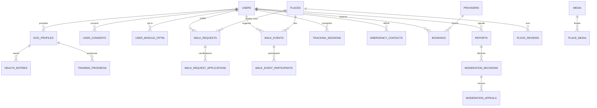
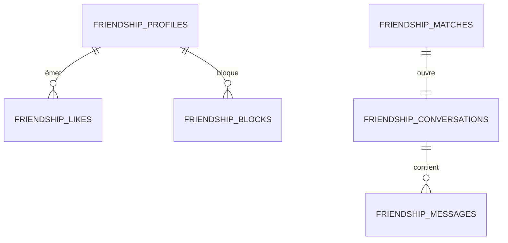
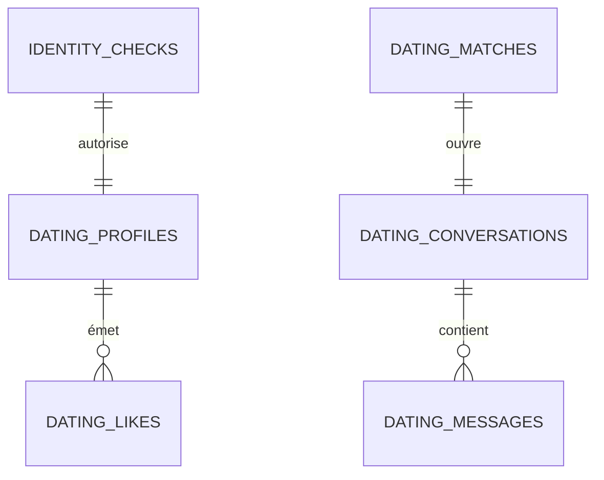

# K9 Global Solution — Modèle de données

> Répond à §6.3 du brief. Trois bases physiquement distinctes (voir `01-architecture.md` §4).
> DDL en PostgreSQL 16 + PostGIS 3.4. Les DDL sont des esquisses de conception destinées à
> la revue, pas des migrations prêtes à exécuter.

## 0. Conventions communes aux trois bases

```sql
-- Extensions autorisées
CREATE EXTENSION IF NOT EXISTS "pgcrypto";   -- gen_random_uuid, chiffrement
CREATE EXTENSION IF NOT EXISTS "citext";     -- e-mails insensibles à la casse
CREATE EXTENSION IF NOT EXISTS "postgis";    -- k9_core uniquement

-- Extensions INTERDITES sur les trois bases (garantie d'étanchéité, §4.1 architecture)
--   postgres_fdw, dblink, pg_cron accédant à plusieurs bases
-- Vérifié en CI par un test qui échoue si l'une d'elles apparaît.

-- Type partagé par SA FORME, redéfini dans CHAQUE base : les bases étant séparées,
-- un type PostgreSQL ne peut pas être commun. C'est une duplication imposée par
-- l'isolation, au même titre que celle du code de matching.
CREATE TYPE moderation_status AS ENUM ('pending', 'approved', 'rejected', 'flagged');
```

**Ordre d'application.** Les blocs ci-dessous suivent l'ordre de lecture, pas l'ordre
d'exécution : `users.avatar_media_id` et `media.owner_id` forment un cycle de clés
étrangères. Dans les migrations réelles, `media` est créée avant `users` et la clé
étrangère de `users` est ajoutée après, par `ALTER TABLE` (voir §1.7).

- Clés primaires : `uuid` généré par `gen_random_uuid()`. Jamais d'entier séquentiel exposé —
  un identifiant incrémental permet d'énumérer les utilisateurs et de mesurer la croissance.
- Horodatages : `timestamptz`, toujours en UTC. Quatre pays, deux fuseaux d'heure d'été
  différents à certaines dates : le `timestamp` sans fuseau est une source de bugs garantie.
- Suppression : `deleted_at timestamptz` pour la suppression logique **uniquement** là où
  c'est fonctionnellement nécessaire. Le droit à l'effacement RGPD impose une suppression
  **réelle** ou une anonymisation irréversible : voir §7.
- Champs chiffrés au niveau applicatif : suffixe `_enc`, type `bytea`, chiffrement par
  enveloppe (DEK par base, KEK dans le KMS). Ne sont jamais indexables ni interrogeables.
- Texte libre soumis à modération : toujours accompagné d'un `moderation_status`.

---

## 1. Base `k9_core` — socle, modules non romantiques, Volet 3

### 1.1 Compte et consentements

```sql
CREATE TYPE user_status AS ENUM ('pending_email', 'active', 'suspended', 'deactivated', 'erased');
-- L'âge minimum étant de 18 ans partout (décision B2), ce qui varie n'est plus l'âge
-- mais le NIVEAU D'ASSURANCE sur cet âge : déclaratif pour les Volets 2 et 3,
-- document vérifié par un tiers pour le Volet 1.
CREATE TYPE age_assurance AS ENUM ('none', 'self_declared', 'document_verified');

CREATE TABLE users (
  id                  uuid PRIMARY KEY DEFAULT gen_random_uuid(),
  email               citext UNIQUE,                  -- NULL après effacement
  external_idp_sub    text UNIQUE,                    -- identifiant Keycloak
  status              user_status NOT NULL DEFAULT 'pending_email',
  -- Aucun mot de passe stocké ici : l'authentification est déléguée à Keycloak.
  birth_date          date,                           -- purgée après contrôle, voir §7
  signup_date         date NOT NULL DEFAULT CURRENT_DATE,
  age_assurance       age_assurance NOT NULL DEFAULT 'none',
  country             char(2) NOT NULL,               -- ISO 3166-1 : LU, BE, FR, DE
  locale              text NOT NULL DEFAULT 'fr',     -- fr, de, en, lb
  display_name        text,
  avatar_media_id     uuid,                           -- FK ajoutée après media, voir §0
  created_at          timestamptz NOT NULL DEFAULT now(),
  last_active_at      timestamptz,
  erased_at           timestamptz,
  CONSTRAINT users_erased_has_no_email CHECK (erased_at IS NULL OR email IS NULL),
  -- Majorité imposée par le moteur, pas par le formulaire d'inscription (ticket D15).
  -- Ancrée sur la DATE D'INSCRIPTION et non sur la date du jour : le contrôle exprime
  -- « était majeur en s'inscrivant », un fait qui ne dérive jamais.
  CONSTRAINT users_adult_at_signup
    CHECK (birth_date IS NULL OR birth_date + INTERVAL '18 years' <= signup_date)
);

CREATE INDEX users_status_idx     ON users (status) WHERE status = 'active';
CREATE INDEX users_last_active_idx ON users (last_active_at DESC NULLS LAST);
```

Trois remarques sur ce bloc, toutes conséquences de la décision « 18 ans partout ».

**Le champ `is_adult` a disparu.** Il n'a plus de sens : si tout utilisateur est majeur, un
booléen de majorité ne distingue rien et ne peut que se désynchroniser. La majorité est
désormais une propriété de la table entière, garantie par contrainte.

**Le contrôle est ancré sur `signup_date`, pas sur la date du jour.** La variante
« intuitive » (`age(birth_date) >= 18 ans`) a été testée et écartée : elle vérifie l'âge au
moment de l'évaluation, donc quelqu'un inscrit à 16 ans passerait le contrôle deux ans plus
tard. La forme retenue exprime un fait daté qui reste vrai indéfiniment.

**`birth_date` est nullable, et c'est voulu.** Après contrôle et à l'issue du délai de
rétention (§7), la date de naissance est purgée : elle a rempli son office et n'a plus de
base légale à être conservée. La contrainte tolère donc `NULL`, qui signifie « contrôlée
puis purgée » — jamais « non contrôlée », l'inscription étant impossible sans elle.

```sql
CREATE TYPE consent_purpose AS ENUM (
  'terms', 'privacy_policy', 'precise_location', 'dog_health_data',
  'profile_photos', 'marketing_email', 'push_notifications', 'analytics'
);

-- Table en ajout seul : un consentement retiré n'est pas une mise à jour, c'est un
-- nouvel enregistrement. Exigence de preuve RGPD (art. 7.1).
CREATE TABLE user_consents (
  id             uuid PRIMARY KEY DEFAULT gen_random_uuid(),
  user_id        uuid NOT NULL REFERENCES users(id) ON DELETE CASCADE,
  purpose        consent_purpose NOT NULL,
  granted        boolean NOT NULL,
  policy_version text NOT NULL,          -- version du texte accepté
  recorded_at    timestamptz NOT NULL DEFAULT now(),
  evidence       jsonb NOT NULL          -- IP tronquée, user-agent, écran d'origine
);

CREATE INDEX user_consents_lookup_idx ON user_consents (user_id, purpose, recorded_at DESC);
REVOKE UPDATE, DELETE ON user_consents FROM app_core;   -- ajout seul, au niveau des droits
```

```sql
CREATE TYPE app_module AS ENUM ('friendship', 'walks');   -- 'dating' vit dans k9_dating

-- Opt-in explicite, aucune valeur par défaut activée (§3.1 du brief).
CREATE TABLE user_module_optin (
  user_id     uuid NOT NULL REFERENCES users(id) ON DELETE CASCADE,
  module      app_module NOT NULL,
  enabled_at  timestamptz NOT NULL DEFAULT now(),
  PRIMARY KEY (user_id, module)
);
```

Noter l'absence de colonne `enabled boolean`. Désactiver un module, c'est supprimer la ligne
et propager un événement de retrait au volet concerné, qui supprime sa projection. Un booléen
à `false` laisserait subsister la projection et donc la visibilité — c'est précisément le
type de bug que la modélisation doit rendre impossible.

### 1.2 Profil chien et santé

```sql
CREATE TYPE dog_sex AS ENUM ('male', 'female');
CREATE TYPE energy_level AS ENUM ('calm', 'moderate', 'active', 'very_active');

CREATE TABLE breeds (
  id        uuid PRIMARY KEY DEFAULT gen_random_uuid(),
  fci_code  text UNIQUE,
  name_i18n jsonb NOT NULL              -- {"fr": "Berger belge", "de": "...", ...}
);

CREATE TABLE dog_profiles (
  id             uuid PRIMARY KEY DEFAULT gen_random_uuid(),
  owner_id       uuid NOT NULL REFERENCES users(id) ON DELETE CASCADE,
  name           text NOT NULL,
  breed_id       uuid REFERENCES breeds(id),
  breed_free     text,                  -- croisé / race non listée
  sex            dog_sex,
  birth_date     date,
  is_sterilized  boolean,
  weight_kg      numeric(5,2),
  energy         energy_level,
  temperament    text[] NOT NULL DEFAULT '{}',   -- 'sociable_dogs', 'reactive_leash', ...
  bio            text,
  chip_number_enc bytea,                -- puce/tatouage : identifiant réglementé, chiffré
  moderation_status moderation_status NOT NULL DEFAULT 'pending',
  created_at     timestamptz NOT NULL DEFAULT now(),
  deleted_at     timestamptz
);

CREATE INDEX dog_profiles_owner_idx ON dog_profiles (owner_id) WHERE deleted_at IS NULL;
```

Le champ `temperament` mérite un mot : `reactive_leash`, `not_dog_friendly` et équivalents ne
sont pas cosmétiques. Ils doivent être **affichés de façon proéminente** dans les Volets 2 et
3 et pris en compte dans les suggestions de balade. Une mise en relation qui aboutit à une
morsure est un incident produit, avec une exposition en responsabilité civile.

```sql
CREATE TYPE health_entry_kind AS ENUM (
  'vaccination', 'deworming', 'antiparasitic', 'vet_visit',
  'weight', 'medication', 'allergy', 'surgery', 'other'
);

-- Données de santé animale : pas des « données de santé » au sens de l'art. 9 RGPD
-- (qui ne couvre que les personnes physiques), mais traitées avec le même soin, car
-- révélatrices du budget, du domicile et des habitudes du propriétaire.
CREATE TABLE health_entries (
  id            uuid PRIMARY KEY DEFAULT gen_random_uuid(),
  dog_id        uuid NOT NULL REFERENCES dog_profiles(id) ON DELETE CASCADE,
  kind          health_entry_kind NOT NULL,
  occurred_on   date NOT NULL,
  next_due_on   date,
  label         text,
  details_enc   bytea,                 -- texte libre, chiffré : peut contenir un diagnostic
  vet_name      text,
  value_numeric numeric(8,2),          -- poids, dose
  attachment_id uuid REFERENCES media(id),
  created_at    timestamptz NOT NULL DEFAULT now()
);

CREATE INDEX health_entries_dog_idx      ON health_entries (dog_id, occurred_on DESC);
CREATE INDEX health_entries_due_idx      ON health_entries (next_due_on)
  WHERE next_due_on IS NOT NULL;

CREATE TABLE reminders (
  id           uuid PRIMARY KEY DEFAULT gen_random_uuid(),
  user_id      uuid NOT NULL REFERENCES users(id) ON DELETE CASCADE,
  dog_id       uuid REFERENCES dog_profiles(id) ON DELETE CASCADE,
  source_entry uuid REFERENCES health_entries(id) ON DELETE CASCADE,
  due_at       timestamptz NOT NULL,
  channel      text NOT NULL DEFAULT 'push',
  sent_at      timestamptz
);

CREATE INDEX reminders_pending_idx ON reminders (due_at) WHERE sent_at IS NULL;
```

### 1.3 Carte des lieux canins — PostGIS

```sql
CREATE TYPE place_kind AS ENUM (
  'dog_park', 'beach', 'trail', 'pet_friendly_terrace', 'pet_friendly_hotel',
  'vet', 'emergency_vet', 'groomer', 'training_ground', 'water_point', 'forbidden_area'
);
CREATE TYPE dog_policy AS ENUM ('off_leash', 'on_leash', 'allowed_restricted', 'forbidden', 'unknown');
CREATE TYPE place_source AS ENUM ('osm', 'community', 'partner', 'internal');
-- moderation_status est défini en §0

CREATE TABLE places (
  id           uuid PRIMARY KEY DEFAULT gen_random_uuid(),
  kind         place_kind NOT NULL,
  name         text NOT NULL,
  geom         geography(Point, 4326) NOT NULL,
  area         geography(Polygon, 4326),        -- emprise pour parcs et zones interdites
  address      text,
  country      char(2) NOT NULL,
  policy       dog_policy NOT NULL DEFAULT 'unknown',
  attributes   jsonb NOT NULL DEFAULT '{}',     -- clôturé, eau, ombre, taille, horaires
  source       place_source NOT NULL,
  osm_ref      text,                            -- 'node/123456' — traçabilité ODbL
  created_by   uuid REFERENCES users(id) ON DELETE SET NULL,
  moderation_status moderation_status NOT NULL DEFAULT 'pending',
  created_at   timestamptz NOT NULL DEFAULT now(),
  deleted_at   timestamptz,
  CONSTRAINT places_osm_ref_required CHECK (source <> 'osm' OR osm_ref IS NOT NULL)
);

-- Index géospatial principal : recherche par proximité et par emprise de carte.
CREATE INDEX places_geom_gix ON places USING GIST (geom);
CREATE INDEX places_area_gix ON places USING GIST (area) WHERE area IS NOT NULL;

-- Index partiel : la carte n'affiche que les lieux publiables. Beaucoup plus petit
-- que l'index complet, donc mieux mis en cache.
CREATE INDEX places_visible_gix ON places USING GIST (geom)
  WHERE moderation_status = 'approved' AND deleted_at IS NULL;

CREATE INDEX places_kind_country_idx ON places (country, kind)
  WHERE moderation_status = 'approved' AND deleted_at IS NULL;
```

La contrainte `places_osm_ref_required` et le type `place_source` matérialisent le point N3
du document de périmètre : les données OpenStreetMap sous licence ODbL restent identifiables
et séparables des contributions utilisateurs. Ne jamais fusionner un enregistrement OSM et un
enregistrement communautaire dans une même ligne — la base dérivée deviendrait entièrement
soumise au partage à l'identique.

Requête type de la carte, paramétrée :

```sql
SELECT id, kind, name, ST_Y(geom::geometry) AS lat, ST_X(geom::geometry) AS lon, policy
FROM places
WHERE moderation_status = 'approved'
  AND deleted_at IS NULL
  AND kind = ANY($1::place_kind[])
  AND ST_DWithin(geom, ST_MakePoint($2, $3)::geography, $4)   -- $4 en mètres, plafonné
ORDER BY geom <-> ST_MakePoint($2, $3)::geography
LIMIT 200;
```

`ST_DWithin` sur `geography` utilise l'index GIST et calcule en mètres sur l'ellipsoïde ;
`<->` donne un tri par distance également indexé. Le rayon `$4` est plafonné côté serveur
(50 km) pour interdire l'aspiration complète de la base en une requête.

```sql
CREATE TABLE place_reviews (
  id       uuid PRIMARY KEY DEFAULT gen_random_uuid(),
  place_id uuid NOT NULL REFERENCES places(id) ON DELETE CASCADE,
  user_id  uuid REFERENCES users(id) ON DELETE SET NULL,
  rating   smallint NOT NULL CHECK (rating BETWEEN 1 AND 5),
  body     text,
  visited_on date,                     -- transparence des avis (droit FR)
  moderation_status moderation_status NOT NULL DEFAULT 'pending',
  created_at timestamptz NOT NULL DEFAULT now(),
  UNIQUE (place_id, user_id)           -- un avis par personne et par lieu
);

CREATE TABLE place_media (
  place_id uuid NOT NULL REFERENCES places(id) ON DELETE CASCADE,
  media_id uuid NOT NULL REFERENCES media(id) ON DELETE CASCADE,
  PRIMARY KEY (place_id, media_id)
);
```

### 1.4 Volet 3 — recherche de compagnon de balade et balades collectives

```sql
CREATE TYPE walk_request_status AS ENUM ('open', 'matched', 'expired', 'cancelled');

-- Annonce publique, pas profil consultable en continu (§3.1 du brief).
CREATE TABLE walk_requests (
  id            uuid PRIMARY KEY DEFAULT gen_random_uuid(),
  author_id     uuid NOT NULL REFERENCES users(id) ON DELETE CASCADE,
  title         text NOT NULL,
  body          text,
  -- Point de rendez-vous : un lieu public référencé, jamais la position de l'auteur.
  meeting_place_id uuid NOT NULL REFERENCES places(id),
  starts_at     timestamptz NOT NULL,
  ends_at       timestamptz NOT NULL,
  recurrence    text,                  -- RRULE RFC 5545, NULL si ponctuel
  energy        energy_level,
  pace          text,
  max_companions smallint NOT NULL DEFAULT 1 CHECK (max_companions BETWEEN 1 AND 10),
  status        walk_request_status NOT NULL DEFAULT 'open',
  moderation_status moderation_status NOT NULL DEFAULT 'pending',
  created_at    timestamptz NOT NULL DEFAULT now(),
  CONSTRAINT walk_requests_time_order CHECK (ends_at > starts_at)
);

CREATE INDEX walk_requests_open_idx ON walk_requests (starts_at)
  WHERE status = 'open' AND moderation_status = 'approved';
CREATE INDEX walk_requests_author_idx ON walk_requests (author_id, created_at DESC);

CREATE TABLE walk_request_applications (
  id            uuid PRIMARY KEY DEFAULT gen_random_uuid(),
  request_id    uuid NOT NULL REFERENCES walk_requests(id) ON DELETE CASCADE,
  applicant_id  uuid NOT NULL REFERENCES users(id) ON DELETE CASCADE,
  dog_ids       uuid[] NOT NULL DEFAULT '{}',
  message       text,
  state         text NOT NULL DEFAULT 'pending',   -- pending, accepted, declined, withdrawn
  created_at    timestamptz NOT NULL DEFAULT now(),
  UNIQUE (request_id, applicant_id)
);
```

La recherche d'annonces s'appuie sur la position du **lieu de rendez-vous**, ce qui évite
toute exposition de la position des personnes :

```sql
SELECT wr.id, wr.title, wr.starts_at, p.name, p.geom
FROM walk_requests wr
JOIN places p ON p.id = wr.meeting_place_id
WHERE wr.status = 'open'
  AND wr.moderation_status = 'approved'
  AND wr.starts_at BETWEEN $1 AND $2
  AND ST_DWithin(p.geom, ST_MakePoint($3, $4)::geography, LEAST($5, 50000))
ORDER BY wr.starts_at;
```

```sql
CREATE TYPE walk_event_status AS ENUM ('draft', 'published', 'cancelled', 'done');

CREATE TABLE walk_events (
  id            uuid PRIMARY KEY DEFAULT gen_random_uuid(),
  host_id       uuid NOT NULL REFERENCES users(id) ON DELETE CASCADE,
  title         text NOT NULL,
  description   text,
  place_id      uuid NOT NULL REFERENCES places(id),
  starts_at     timestamptz NOT NULL,
  duration_min  smallint,
  capacity      smallint CHECK (capacity IS NULL OR capacity BETWEEN 2 AND 100),
  energy        energy_level,
  status        walk_event_status NOT NULL DEFAULT 'draft',
  moderation_status moderation_status NOT NULL DEFAULT 'pending',
  created_at    timestamptz NOT NULL DEFAULT now()
);

CREATE INDEX walk_events_upcoming_idx ON walk_events (starts_at)
  WHERE status = 'published' AND moderation_status = 'approved';

CREATE TABLE walk_event_participants (
  event_id  uuid NOT NULL REFERENCES walk_events(id) ON DELETE CASCADE,
  user_id   uuid NOT NULL REFERENCES users(id) ON DELETE CASCADE,
  dog_ids   uuid[] NOT NULL DEFAULT '{}',
  state     text NOT NULL DEFAULT 'going',
  joined_at timestamptz NOT NULL DEFAULT now(),
  PRIMARY KEY (event_id, user_id)
);

CREATE TABLE walk_groups (          -- groupes par quartier, race, niveau d'énergie
  id       uuid PRIMARY KEY DEFAULT gen_random_uuid(),
  name     text NOT NULL,
  kind     text NOT NULL,           -- neighbourhood, breed, energy
  area     geography(Polygon, 4326),
  country  char(2),
  created_by uuid REFERENCES users(id) ON DELETE SET NULL,
  moderation_status moderation_status NOT NULL DEFAULT 'pending'
);
CREATE INDEX walk_groups_area_gix ON walk_groups USING GIST (area) WHERE area IS NOT NULL;
```

### 1.5 Tracking sportif — pistage, mantrailing, cani-cross

```sql
CREATE TYPE activity_kind AS ENUM ('walk', 'mantrailing', 'tracking', 'canicross', 'cani_hiking', 'bikejoring');

CREATE TABLE tracking_sessions (
  id             uuid PRIMARY KEY DEFAULT gen_random_uuid(),
  user_id        uuid NOT NULL REFERENCES users(id) ON DELETE CASCADE,
  dog_ids        uuid[] NOT NULL DEFAULT '{}',
  activity       activity_kind NOT NULL,
  started_at     timestamptz NOT NULL,
  ended_at       timestamptz,
  distance_m     integer,
  duration_s     integer,
  elevation_gain_m integer,
  avg_speed_kmh  numeric(5,2),
  -- Trace simplifiée (Douglas-Peucker) pour l'affichage et les statistiques.
  simplified_path geography(LineString, 4326),
  -- Points bruts : stockés en objet (GPX/protobuf), pas en base. Une session de
  -- mantrailing d'une heure à 1 Hz = 3600 points ; en table, cela devient la plus
  -- grosse table du système sans bénéfice de requête.
  raw_track_key  text,
  is_private     boolean NOT NULL DEFAULT true,
  created_at     timestamptz NOT NULL DEFAULT now(),
  CONSTRAINT tracking_time_order CHECK (ended_at IS NULL OR ended_at >= started_at)
);

CREATE INDEX tracking_sessions_user_idx ON tracking_sessions (user_id, started_at DESC);
CREATE INDEX tracking_sessions_path_gix ON tracking_sessions USING GIST (simplified_path);
```

`is_private` par défaut à `true` : une trace GPS est le tracé exact des habitudes de
promenade d'une personne, partant très souvent de son domicile. Le partage doit être un acte
délibéré, et l'export GPX doit proposer de tronquer les premiers et derniers cent mètres.

### 1.6 Éducation, hébergement, premiers secours

```sql
CREATE TABLE training_programs (
  id          uuid PRIMARY KEY DEFAULT gen_random_uuid(),
  slug        text UNIQUE NOT NULL,
  title_i18n  jsonb NOT NULL,
  level       smallint NOT NULL,
  duration_days smallint,
  published   boolean NOT NULL DEFAULT false
);

CREATE TABLE training_steps (
  id          uuid PRIMARY KEY DEFAULT gen_random_uuid(),
  program_id  uuid NOT NULL REFERENCES training_programs(id) ON DELETE CASCADE,
  position    smallint NOT NULL,
  title_i18n  jsonb NOT NULL,
  body_i18n   jsonb NOT NULL,
  media_id    uuid REFERENCES media(id),
  UNIQUE (program_id, position)
);

CREATE TABLE training_progress (
  user_id     uuid NOT NULL REFERENCES users(id) ON DELETE CASCADE,
  dog_id      uuid NOT NULL REFERENCES dog_profiles(id) ON DELETE CASCADE,
  step_id     uuid NOT NULL REFERENCES training_steps(id) ON DELETE CASCADE,
  completed_at timestamptz NOT NULL DEFAULT now(),
  rating      smallint,
  PRIMARY KEY (user_id, dog_id, step_id)
);
```

```sql
CREATE TYPE booking_kind AS ENUM ('accommodation', 'adapted_vehicle', 'k9_service');
CREATE TYPE booking_state AS ENUM ('enquiry', 'confirmed', 'cancelled', 'completed');

CREATE TABLE providers (
  id        uuid PRIMARY KEY DEFAULT gen_random_uuid(),
  kind      booking_kind NOT NULL,
  name      text NOT NULL,
  country   char(2) NOT NULL,
  geom      geography(Point, 4326),
  vat_number text,
  contact   jsonb NOT NULL DEFAULT '{}',
  dog_facilities jsonb NOT NULL DEFAULT '{}',  -- caisses, cloisons, ventilation, taille max
  is_active boolean NOT NULL DEFAULT true
);
CREATE INDEX providers_geom_gix ON providers USING GIST (geom) WHERE is_active;

CREATE TABLE bookings (
  id           uuid PRIMARY KEY DEFAULT gen_random_uuid(),
  user_id      uuid NOT NULL REFERENCES users(id) ON DELETE RESTRICT, -- obligation comptable
  provider_id  uuid NOT NULL REFERENCES providers(id),
  kind         booking_kind NOT NULL,
  starts_on    date NOT NULL,
  ends_on      date NOT NULL,
  dog_count    smallint NOT NULL DEFAULT 1,
  state        booking_state NOT NULL DEFAULT 'enquiry',
  -- Aucune donnée de carte. Uniquement une référence opaque du PSP (§3.4).
  psp_reference text,
  amount_cents integer,
  currency     char(3) DEFAULT 'EUR',
  created_at   timestamptz NOT NULL DEFAULT now()
);
```

`ON DELETE RESTRICT` sur `bookings.user_id` est délibéré : une transaction financière relève
d'une obligation légale de conservation (dix ans au Luxembourg) qui prime sur le droit à
l'effacement (art. 17.3.b RGPD). Le compte est anonymisé, la réservation conservée — voir §7.

```sql
CREATE TABLE first_aid_articles (
  id         uuid PRIMARY KEY DEFAULT gen_random_uuid(),
  slug       text UNIQUE NOT NULL,
  title_i18n jsonb NOT NULL,
  body_i18n  jsonb NOT NULL,
  severity   smallint NOT NULL,      -- 1 = informatif, 3 = urgence vitale
  reviewed_by text NOT NULL,          -- vétérinaire relecteur — voir N4
  reviewed_at date NOT NULL,
  available_offline boolean NOT NULL DEFAULT true
);

CREATE TABLE emergency_contacts (
  id        uuid PRIMARY KEY DEFAULT gen_random_uuid(),
  user_id   uuid NOT NULL REFERENCES users(id) ON DELETE CASCADE,
  label     text NOT NULL,
  phone_enc bytea NOT NULL,           -- numéro d'un tiers : chiffré
  kind      text NOT NULL,            -- vet, owner_backup, poison_control
  position  smallint NOT NULL DEFAULT 0
);
```

Le guide de premiers secours doit être **entièrement disponible hors ligne** : les situations
d'urgence surviennent en forêt, hors couverture réseau. C'est une contrainte fonctionnelle
qui impose un contenu embarqué dans l'application, synchronisé, et non chargé à la demande.

### 1.7 Média, modération, journal d'audit

```sql
CREATE TYPE media_state AS ENUM ('quarantined', 'scanning', 'published', 'rejected', 'purged');

CREATE TABLE media (
  id            uuid PRIMARY KEY DEFAULT gen_random_uuid(),
  owner_id      uuid REFERENCES users(id) ON DELETE SET NULL,
  state         media_state NOT NULL DEFAULT 'quarantined',
  bucket        text NOT NULL,
  object_key    text NOT NULL,
  mime_type     text NOT NULL,
  bytes         integer NOT NULL,
  width         integer,
  height        integer,
  sha256        bytea NOT NULL,
  exif_stripped boolean NOT NULL DEFAULT false,
  av_verdict    text,
  classifier_scores jsonb,
  created_at    timestamptz NOT NULL DEFAULT now(),
  published_at  timestamptz,
  CONSTRAINT media_published_requires_strip
    CHECK (state <> 'published' OR exif_stripped = true)
);

CREATE UNIQUE INDEX media_sha_idx ON media (sha256);   -- déduplication + hachage de rejets

-- Fermeture du cycle users <-> media annoncé en §0.
ALTER TABLE users
  ADD CONSTRAINT users_avatar_media_fk
  FOREIGN KEY (avatar_media_id) REFERENCES media(id) ON DELETE SET NULL;
```

La contrainte `media_published_requires_strip` est un exemple de ce que je cherche à faire
systématiquement : transformer une règle de sécurité en contrainte de base de données. Publier
une photo dont les EXIF n'ont pas été retirés devient une erreur d'écriture, pas un oubli
possible en revue de code.

```sql
CREATE TYPE report_reason AS ENUM (
  'harassment', 'sexual_content', 'minor_suspected', 'scam', 'off_platform_contact',
  'animal_welfare', 'fake_profile', 'hate_speech', 'wrong_place_info', 'other'
);
CREATE TYPE report_state AS ENUM ('received', 'triaged', 'actioned', 'dismissed', 'escalated');
CREATE TYPE moderation_surface AS ENUM (
  'dog_profile', 'place', 'place_review', 'walk_request', 'walk_event',
  'media', 'friendship_profile', 'friendship_message',
  'dating_profile', 'dating_message'
);

-- Les signalements de TOUS les volets convergent ici : c'est le seul point de
-- mutualisation autorisé entre volets, et il est unidirectionnel (écriture seule
-- depuis les volets, aucune lecture des volets vers ici).
CREATE TABLE reports (
  id            uuid PRIMARY KEY DEFAULT gen_random_uuid(),
  reporter_id   uuid REFERENCES users(id) ON DELETE SET NULL,
  surface       moderation_surface NOT NULL,
  target_ref    text NOT NULL,        -- UUID de la ressource dans SA base d'origine
  target_user_id uuid,                -- personne visée, si applicable
  reason        report_reason NOT NULL,
  body          text,
  state         report_state NOT NULL DEFAULT 'received',
  -- Traitement prioritaire sous 24 h (§3.1). Les motifs graves passent devant.
  priority      smallint NOT NULL DEFAULT 3,
  sla_due_at    timestamptz NOT NULL DEFAULT (now() + interval '24 hours'),
  created_at    timestamptz NOT NULL DEFAULT now(),
  resolved_at   timestamptz
);

CREATE INDEX reports_sla_idx ON reports (priority, sla_due_at)
  WHERE state IN ('received', 'triaged');
CREATE INDEX reports_target_user_idx ON reports (target_user_id) WHERE target_user_id IS NOT NULL;
```

`target_ref` est volontairement du `text` et non une clé étrangère : la ressource visée peut
vivre dans `k9_friendship` ou `k9_dating`, où une contrainte référentielle serait impossible.
C'est le prix de l'étanchéité, et il est acceptable ici.

```sql
CREATE TYPE moderation_action AS ENUM (
  'content_removed', 'content_restored', 'profile_hidden', 'account_suspended',
  'account_banned', 'warning_sent', 'no_action', 'law_enforcement_referral'
);

CREATE TABLE moderation_decisions (
  id           uuid PRIMARY KEY DEFAULT gen_random_uuid(),
  report_id    uuid REFERENCES reports(id) ON DELETE SET NULL,
  surface      moderation_surface NOT NULL,
  target_ref   text NOT NULL,
  action       moderation_action NOT NULL,
  -- Exigences DSA art. 17 : motif, base, automatisation, voies de recours.
  reason_code  text NOT NULL,
  legal_or_tos_basis text NOT NULL,
  was_automated boolean NOT NULL,
  statement_sent_at timestamptz,
  appeal_deadline_at timestamptz,
  decided_by   uuid,                  -- modérateur, NULL si automatique
  decided_at   timestamptz NOT NULL DEFAULT now()
);

CREATE TABLE moderation_appeals (
  id          uuid PRIMARY KEY DEFAULT gen_random_uuid(),
  decision_id uuid NOT NULL REFERENCES moderation_decisions(id) ON DELETE CASCADE,
  user_id     uuid NOT NULL REFERENCES users(id) ON DELETE CASCADE,
  body        text NOT NULL,
  outcome     text,
  created_at  timestamptz NOT NULL DEFAULT now(),
  resolved_at timestamptz
);
```

```sql
-- Journal d'audit immuable, par volet (§3.1). Chaînage par hachage : toute
-- modification ou suppression d'une ligne antérieure casse la chaîne et se détecte.
CREATE TABLE audit_log (
  seq         bigserial PRIMARY KEY,
  scope       text NOT NULL,          -- 'core' | 'friendship' | 'dating' | 'admin'
  actor_id    uuid,
  actor_kind  text NOT NULL,          -- user, moderator, system, support
  action      text NOT NULL,
  target_ref  text,
  payload     jsonb NOT NULL DEFAULT '{}',   -- jamais de contenu de message en clair
  ip_prefix   inet,                   -- IP tronquée /24 ou /48 : minimisation
  occurred_at timestamptz NOT NULL DEFAULT now(),
  prev_hash   bytea,
  entry_hash  bytea NOT NULL
);

CREATE INDEX audit_log_scope_time_idx ON audit_log (scope, occurred_at DESC);
CREATE INDEX audit_log_actor_idx      ON audit_log (actor_id, occurred_at DESC);

-- Immuabilité au niveau des droits, pas seulement par convention applicative.
REVOKE UPDATE, DELETE, TRUNCATE ON audit_log FROM app_core, app_friendship, app_dating;

-- Piège vérifié en test : REVOKE sur la table ne suffit pas. Sans droit explicite sur
-- la séquence du bigserial, le rôle applicatif ne peut même plus AJOUTER une entrée,
-- et toute la journalisation d'audit tombe en silence. À ne pas oublier en migration.
GRANT USAGE ON SEQUENCE audit_log_seq_seq TO app_core;
```

L'immuabilité par `REVOKE` est le point important. Un journal d'audit que le rôle applicatif
peut modifier n'est pas un journal d'audit : c'est un fichier de log avec des prétentions.
La purge par rétention est faite par un rôle distinct (`app_retention`), sur une fenêtre
temporelle uniquement, et ses propres opérations sont elles-mêmes journalisées.

```sql
-- Table outbox : propagation d'événements vers les bases de volet sans jointure.
CREATE TABLE outbox (
  id          bigserial PRIMARY KEY,
  topic       text NOT NULL,          -- ProfileUpdated, UserErased, UserSuspended
  payload     jsonb NOT NULL,
  created_at  timestamptz NOT NULL DEFAULT now(),
  processed_at timestamptz
);
CREATE INDEX outbox_pending_idx ON outbox (id) WHERE processed_at IS NULL;
```

---

## 2. Base `k9_friendship` — Volet 2, isolée

Aucune clé étrangère vers `k9_core` : les identifiants utilisateurs sont des UUID opaques,
alimentés par projection (`01-architecture.md` §5). L'intégrité est maintenue par
consommation d'événements, pas par le moteur.

```sql
-- Types redéfinis localement : base séparée, donc catalogue séparé (§0).
CREATE TYPE moderation_status AS ENUM ('pending', 'approved', 'rejected', 'flagged');

CREATE TABLE friendship_profiles (
  user_id        uuid PRIMARY KEY,          -- opaque, PAS de REFERENCES
  display_name   text NOT NULL,             -- projeté
  avatar_key     text,                      -- projeté
  bio            text,
  dog_summary    jsonb NOT NULL DEFAULT '{}',   -- race, tranche d'âge, énergie
  -- Position accrochée à une grille ~1 km, avec décalage stable par utilisateur (§6 archi).
  coarse_geohash text NOT NULL,
  coarse_point   geography(Point, 4326) NOT NULL,
  country        char(2) NOT NULL,
  search_radius_m integer NOT NULL DEFAULT 20000 CHECK (search_radius_m <= 50000),
  languages      char(2)[] NOT NULL DEFAULT '{}',
  is_active      boolean NOT NULL DEFAULT true,
  last_active_at timestamptz NOT NULL DEFAULT now(),
  created_at     timestamptz NOT NULL DEFAULT now()
);

CREATE INDEX friendship_discovery_gix ON friendship_profiles USING GIST (coarse_point)
  WHERE is_active = true;
CREATE INDEX friendship_active_idx ON friendship_profiles (last_active_at DESC)
  WHERE is_active = true;
```

```sql
CREATE TYPE friendship_decision AS ENUM ('interested', 'pass');

CREATE TABLE friendship_likes (
  from_user_id uuid NOT NULL,
  to_user_id   uuid NOT NULL,
  decision     friendship_decision NOT NULL,
  created_at   timestamptz NOT NULL DEFAULT now(),
  PRIMARY KEY (from_user_id, to_user_id),
  CONSTRAINT friendship_no_self_like CHECK (from_user_id <> to_user_id)
);
CREATE INDEX friendship_likes_incoming_idx ON friendship_likes (to_user_id)
  WHERE decision = 'interested';

CREATE TABLE friendship_matches (
  id         uuid PRIMARY KEY DEFAULT gen_random_uuid(),
  user_a     uuid NOT NULL,
  user_b     uuid NOT NULL,
  matched_at timestamptz NOT NULL DEFAULT now(),
  closed_at  timestamptz,
  closed_by  uuid,
  -- Paire ordonnée : garantit l'unicité quel que soit le sens de découverte.
  CONSTRAINT friendship_pair_ordered CHECK (user_a < user_b),
  CONSTRAINT friendship_pair_unique UNIQUE (user_a, user_b)
);

CREATE TABLE friendship_conversations (
  id         uuid PRIMARY KEY DEFAULT gen_random_uuid(),
  match_id   uuid NOT NULL UNIQUE REFERENCES friendship_matches(id) ON DELETE CASCADE,
  created_at timestamptz NOT NULL DEFAULT now()
);

CREATE TABLE friendship_messages (
  id           uuid PRIMARY KEY DEFAULT gen_random_uuid(),
  conversation_id uuid NOT NULL REFERENCES friendship_conversations(id) ON DELETE CASCADE,
  sender_id    uuid NOT NULL,
  body_enc     bytea NOT NULL,        -- chiffré avec la clé k-friend
  media_key    text,
  moderation_status moderation_status NOT NULL DEFAULT 'approved',
  flagged_reason text,
  sent_at      timestamptz NOT NULL DEFAULT now(),
  read_at      timestamptz,
  deleted_at   timestamptz
);
CREATE INDEX friendship_messages_conv_idx ON friendship_messages (conversation_id, sent_at DESC);

CREATE TABLE friendship_blocks (
  blocker_id uuid NOT NULL,
  blocked_id uuid NOT NULL,
  created_at timestamptz NOT NULL DEFAULT now(),
  PRIMARY KEY (blocker_id, blocked_id)
);
```

Le blocage est **local au volet** : bloquer quelqu'un dans le Volet 2 ne peut pas le bloquer
dans le Volet 1, puisque les deux bases s'ignorent. C'est une conséquence directe de
l'étanchéité, et elle est contre-intuitive pour l'utilisateur. **Elle doit être expliquée
dans l'interface** — « ce blocage s'applique au module Amitié » — sinon on crée un faux
sentiment de sécurité. Un blocage global n'est possible que par un événement `UserBlocked`
diffusé depuis `core` vers chaque volet ; je recommande de l'offrir en option explicite
(« bloquer partout »), qui elle ne révèle rien puisque c'est l'utilisateur qui la demande.

---

## 3. Base `k9_dating` — Volet 1, instance séparée

**Non implémentée avant validation et audit des Phases 0, 1 et 2a (§6.5 du brief).** Le
schéma est donné pour que l'isolation soit conçue dès maintenant, pas pour être appliqué.

```sql
CREATE TYPE idv_verdict AS ENUM ('pending', 'approved', 'declined', 'expired', 'review');

-- Résultat de vérification. Aucune image de document, aucun numéro de pièce
-- d'identité : seul le verdict du prestataire et le minimum de preuve.
-- Ne pas construire de coffre-fort de documents d'identité est la meilleure
-- protection possible contre sa compromission.
CREATE TABLE identity_checks (
  id            uuid PRIMARY KEY DEFAULT gen_random_uuid(),
  user_id       uuid NOT NULL,
  provider      text NOT NULL,          -- veriff | yoti | itsme
  provider_session_id text NOT NULL UNIQUE,
  verdict       idv_verdict NOT NULL DEFAULT 'pending',
  is_over_18    boolean,
  verified_at   timestamptz,
  expires_at    timestamptz,
  evidence_ref  text,                   -- référence chez le prestataire, pas le document
  created_at    timestamptz NOT NULL DEFAULT now()
);
CREATE UNIQUE INDEX identity_checks_valid_idx ON identity_checks (user_id)
  WHERE verdict = 'approved';

CREATE TABLE dating_profiles (
  user_id        uuid PRIMARY KEY,
  identity_check_id uuid NOT NULL REFERENCES identity_checks(id),
  display_name   text NOT NULL,
  avatar_key     text NOT NULL,
  bio            text,
  dog_summary    jsonb NOT NULL DEFAULT '{}',
  coarse_geohash text NOT NULL,
  coarse_point   geography(Point, 4326) NOT NULL,
  search_radius_m integer NOT NULL DEFAULT 30000 CHECK (search_radius_m <= 100000),
  is_active      boolean NOT NULL DEFAULT false,
  photos_reviewed_at timestamptz,
  created_at     timestamptz NOT NULL DEFAULT now(),
  -- L'existence d'un profil actif est conditionnée par la vérification ET la revue
  -- photo humaine, au niveau du moteur. Pas de contournement applicatif possible.
  CONSTRAINT dating_active_requires_photo_review
    CHECK (is_active = false OR photos_reviewed_at IS NOT NULL)
);

-- Verrou structurel : un profil ne peut exister que si sa vérification est approuvée
-- et porte le même utilisateur. Appliqué par déclencheur, car une contrainte CHECK
-- ne peut pas interroger une autre table.
CREATE OR REPLACE FUNCTION dating_profile_requires_verified_identity()
RETURNS trigger LANGUAGE plpgsql AS $$
BEGIN
  IF NOT EXISTS (
    SELECT 1 FROM identity_checks c
    WHERE c.id = NEW.identity_check_id
      AND c.user_id = NEW.user_id
      AND c.verdict = 'approved'
      AND c.is_over_18 = true
      AND (c.expires_at IS NULL OR c.expires_at > now())
  ) THEN
    RAISE EXCEPTION 'dating profile requires an approved adult identity check';
  END IF;
  RETURN NEW;
END $$;

CREATE TRIGGER dating_profiles_identity_guard
  BEFORE INSERT OR UPDATE ON dating_profiles
  FOR EACH ROW EXECUTE FUNCTION dating_profile_requires_verified_identity();
```

Le reste (`dating_likes`, `dating_matches`, `dating_conversations`, `dating_messages`,
`dating_blocks`) reprend la forme du Volet 2, **en code entièrement séparé**, avec deux
différences :

1. `dating_messages` porte un `moderation_status` par défaut à `pending` et non `approved` :
   aucune messagerie non modérée entre un compte non vérifié et un autre utilisateur (§3.1).
2. Une contrainte interdit tout like ou message émis depuis un `user_id` absent de
   `dating_profiles` — donc absent de la vérification d'identité.

---

## 4. Vue d'ensemble des relations







Les trois diagrammes sont volontairement séparés : il n'existe **aucune relation** entre eux.
Le lien `users.id` ↔ `friendship_profiles.user_id` est une égalité de valeur maintenue par
l'application, jamais une contrainte du moteur — et c'est précisément ce qui rend la jointure
impossible.

---

## 5. Récapitulatif des index géospatiaux

| Table | Colonne | Index | Requête servie |
|---|---|---|---|
| `places` | `geom` | GIST | proximité, emprise de carte |
| `places` | `geom` | GIST partiel (`approved`) | affichage carte publique |
| `places` | `area` | GIST partiel | appartenance à un parc ou zone interdite |
| `walk_groups` | `area` | GIST partiel | groupes de quartier |
| `providers` | `geom` | GIST partiel (`is_active`) | loueurs et hébergements proches |
| `tracking_sessions` | `simplified_path` | GIST | traces recoupant une emprise |
| `friendship_profiles` | `coarse_point` | GIST partiel (`is_active`) | découverte Volet 2 |
| `dating_profiles` | `coarse_point` | GIST partiel (`is_active`) | découverte Volet 1 |

Choix de `geography` plutôt que `geometry` : les distances sont en mètres sur l'ellipsoïde
sans reprojection. Sur la Grande Région, une projection métrique locale (EPSG:3035) serait
légèrement plus rapide, mais l'écart est négligeable aux volumes attendus et `geography`
supprime une classe entière d'erreurs d'unités.

---

## 6. Volumétrie attendue et implications

| Table | Ordre de grandeur à 10 000 utilisateurs actifs | Conséquence |
|---|---|---|
| `users`, `dog_profiles` | 10⁴ | trivial |
| `places` | 10⁴–10⁵ (dont OSM) | index GIST partiel suffit |
| `health_entries` | 10⁵ | index par chien suffit |
| `walk_requests` | 10⁵/an | partition annuelle si besoin, pas au MVP |
| `friendship_likes` | 10⁶–10⁷ | table la plus volumineuse : surveiller le gonflement, `autovacuum` agressif |
| `tracking_sessions` | 10⁵ | métadonnées seules en base |
| points GPS bruts | 10⁸ si en base | **c'est pourquoi ils vont en stockage objet** |
| `audit_log` | 10⁶–10⁷ | partition mensuelle + purge par rétention |

Les tables de `likes` sont celles qui posent problème dans les applications de ce type : elles
grossissent en O(utilisateurs × profils vus) et subissent beaucoup de suppressions.
Recommandation : partitionner par hachage de `from_user_id` dès que l'on dépasse 10⁷ lignes,
et ne jamais tenter d'y faire une requête analytique en production.

---

## 7. Rétention et droit à l'effacement

Le droit à l'effacement (art. 17 RGPD) ne se réduit pas à un `DELETE FROM users`. Trois
régimes coexistent :

| Donnée | Rétention | Effacement du compte |
|---|---|---|
| Compte, profil, photos | durée du compte | suppression réelle |
| `birth_date` | 12 mois après inscription, puis purgée — la contrainte `users_adult_at_signup` a déjà fait foi | supprimée |
| Profils chien, carnet de santé | durée du compte | suppression réelle |
| Messages (tous volets) | durée du compte, ou 12 mois après clôture de la conversation | suppression réelle, **y compris côté destinataire** |
| Traces GPS | jusqu'à suppression par l'utilisateur | suppression réelle (base + objets) |
| Avis sur les lieux | conservés, **dissociés** de l'auteur (`user_id → NULL`) | anonymisation : l'avis a une valeur pour la communauté et n'est plus une donnée personnelle |
| `reports` et `moderation_decisions` | 3 ans à compter de la décision | **conservés**, pseudonymisés — obligation DSA de traçabilité et de rapport, art. 17.3.e |
| `audit_log` | 3 ans (12 mois pour les entrées purement techniques) | **conservé**, contient des identifiants et non des contenus |
| `bookings`, factures | 10 ans (loi comptable LU) | **conservés**, compte dissocié |
| `identity_checks` (Volet 1) | verdict conservé 3 ans, `evidence_ref` purgé à 90 jours | verdict conservé pour empêcher la recréation d'un compte banni |
| `user_consents` | 3 ans après retrait | conservés, preuve de licéité |

Procédure d'effacement, exécutée comme une saga et non comme une transaction (les bases sont
séparées, il n'y a donc pas de transaction distribuée) :

```
1. users.status = 'erased', email = NULL, session révoquée dans Keycloak
2. outbox : publication de UserErased{user_id}
3. k9_friendship : suppression profil, likes, messages, blocs → accusé
4. k9_dating     : suppression profil, likes, messages ; identity_checks conservé → accusé
5. k9_core       : suppression chiens, santé, traces, contacts ; dissociation avis/réservations
6. Stockage objet : suppression des objets, purge du cache CDN
7. audit_log : entrée 'user_erasure_completed' avec les accusés de chaque base
8. Confirmation à l'utilisateur sous 30 jours (délai légal)
```

L'étape 7 est ce qui rend le droit à l'effacement **démontrable** : sans accusé par base, on
ne peut pas prouver à la CNPD que l'effacement a été complet. Une saga incomplète doit
déclencher une alerte, pas échouer silencieusement.

## 8. Vérification — ce schéma a été exécuté, pas seulement rédigé

L'ensemble du DDL ci-dessus a été appliqué sur **PostgreSQL 16.13 + PostGIS 3.4.2**, dans
trois bases séparées avec trois rôles distincts, puis les garanties annoncées ont été testées.
Résultats :

| Test | Attendu | Obtenu |
|---|---|---|
| Application du DDL des trois bases | aucune erreur | ✅ 0 erreur |
| Inscription à 17 ans | rejet | ✅ violation de `users_adult_at_signup` |
| Inscription à 18 ans pile | acceptation | ✅ |
| Inscription la veille des 18 ans | rejet | ✅ rejeté |
| Inscription rétroactive d'un mineur (né 2010, inscrit 2020) | rejet | ✅ rejeté |
| Purge de `birth_date` après contrôle | possible | ✅ |
| Variante `age(birth_date) >= 18 ans` | **écartée** | ⚠️ accepte un compte créé à 16 ans une fois l'utilisateur devenu majeur — dérive dans le temps |
| `app_core` → connexion à `k9_dating` | refus | ✅ `FATAL: permission denied for database "k9_dating"` |
| `app_core` → connexion à `k9_friendship` | refus | ✅ refus |
| `app_core` → connexion à `k9_core` | succès | ✅ |
| `CREATE EXTENSION postgres_fdw` par un rôle applicatif | refus | ✅ `permission denied to create extension` |
| `CREATE EXTENSION dblink` par un rôle applicatif | refus | ✅ refus |
| `dating_profiles` avec vérification `declined` | rejet | ✅ `dating profile requires an approved adult identity check` |
| `dating_profiles` avec vérification `approved` + majeur | acceptation | ✅ |
| `is_active = true` sans `photos_reviewed_at` | rejet | ✅ violation de `dating_active_requires_photo_review` |
| `media` publié avec `exif_stripped = false` | rejet | ✅ violation de `media_published_requires_strip` |
| `audit_log` : ajout par le rôle applicatif | succès | ✅ (après `GRANT USAGE` sur la séquence) |
| `audit_log` : `UPDATE` / `DELETE` / `TRUNCATE` | refus | ✅ `permission denied for table audit_log` |
| Requêtes carte et annonces (`PREPARE` + `EXECUTE`) | exécution | ✅ |
| Index GIST partiel sur 20 000 lieux | index utilisé | ✅ `Bitmap Index Scan on places_visible_gix` |

Deux enseignements de cette exécution, intégrés ci-dessus :

1. Le `REVOKE` sur `audit_log` bloque aussi l'ajout tant que la séquence du `bigserial` n'est
   pas explicitement accordée. Découvert en test ; en production, cela aurait fait tomber la
   journalisation d'audit sans erreur visible côté produit.
2. `users` et `media` forment un cycle de clés étrangères, qui impose de créer `media`
   d'abord et d'ajouter la contrainte de `users` par `ALTER TABLE` (voir §0 et §1.7).

Ce qui **n'est pas** prouvé par ces tests : que l'application respectera ces frontières. Les
tests ci-dessus valident les garanties du moteur ; les garanties applicatives relèvent des
tickets C01 à C08 et de l'audit externe.

## 9. Portabilité des données (art. 20)

Export à la demande, généré de façon asynchrone, livré par URL présignée à durée de vie
courte, protégé par réauthentification : archive contenant `profil.json`, `chiens.json`,
`sante.json`, `balades.json`, les traces en **GPX** (format ouvert, réutilisable dans
d'autres applications — c'est l'esprit de l'article 20), les messages par volet dans des
fichiers séparés, et les médias d'origine. L'export ne contient **jamais** les données
personnelles d'un tiers : dans une conversation, les messages de l'autre partie sont
remplacés par un marqueur, car ils ne sont pas les données de la personne qui exporte.
