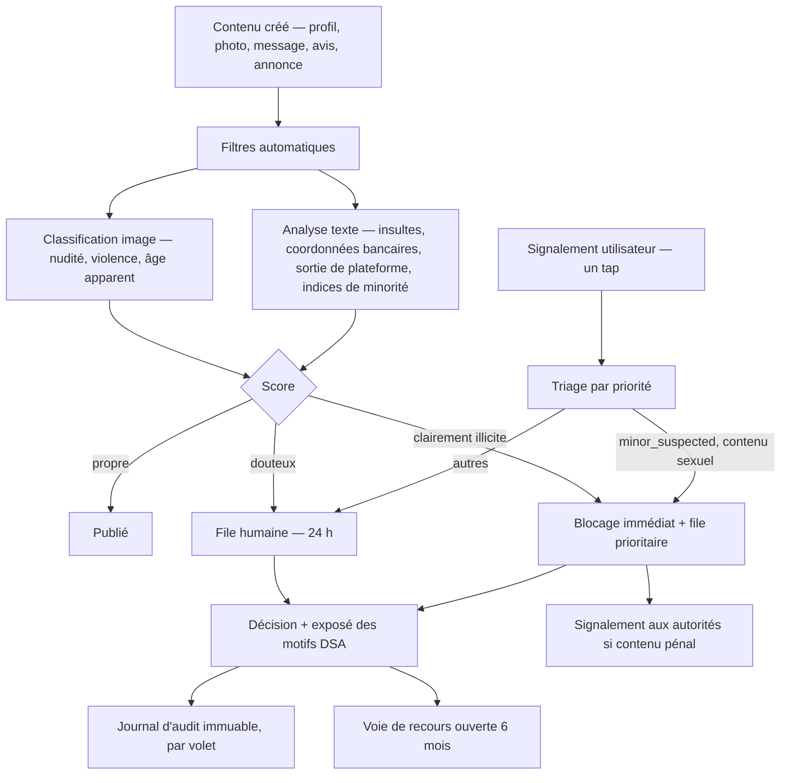

# K9 Global Solution — Plan de sécurité et de conformité

> Répond à la section 3 du brief. Les tickets actionnables correspondants sont dans
> `04-backlog-securite.md`. Ce document explique le *pourquoi* ; le backlog porte le *quoi*.

## 1. Modèle de menace

Avant la liste des contrôles, voici contre quoi ils protègent. Un plan de sécurité qui
n'énonce pas ses adversaires est une liste de courses.

| # | Adversaire | Objectif | Impact | Contrôles principaux |
|---|---|---|---|---|
| M1 | **Adulte cherchant à contacter un mineur** | Entrer en contact via un volet social | Catastrophique — pénal, réputationnel, fin du produit | Âge minimum 18 ans partout (décision B2), vérification d'identité Volet 1, modération photo, classification d'âge apparent, signalement `minor_suspected` en priorité 1, détection de vocabulaire |
| M2 | **Harceleur / conjoint violent** | Localiser une personne précise | Grave — danger physique | Distances en paliers, décalage stable par utilisateur, jamais de coordonnées d'un tiers renvoyées, suppression EXIF, blocage en un tap |
| M3 | **Escroc sentimental (« romance scam »)** | Extorquer de l'argent | Grave — préjudice financier, réputation | Détection de coordonnées bancaires et de sortie de plateforme, limitation de comptes multiples, vérification d'identité Volet 1, signalement `scam` |
| M4 | **Faux profils en masse / bots** | Spam, hameçonnage, gonflement | Modéré à grave | Attestation d'appareil (Play Integrity / App Attest), CAPTCHA, limitation par IP et par appareil, vérification e-mail |
| M5 | **Attaquant externe opportuniste** | Fuite de la base, prise de contrôle | Grave — notification CNPD, perte de confiance | OWASP Top 10, WAF, rate limiting, secrets managés, moindre privilège, chiffrement au repos |
| M6 | **Attaquant ciblant le Volet 1** | Exfiltrer conversations et vérifications d'identité | Catastrophique | Instance séparée, clés séparées, accès humain à deux, pentest externe préalable, pas de coffre de documents |
| M7 | **Voleur du téléphone de l'utilisateur** | Accès au compte, au carnet de santé, aux conversations | Modéré | Verrouillage biométrique optionnel de l'app, tokens courts, révocation à distance des sessions |
| M8 | **Insider (développeur, modérateur, support)** | Curiosité, revente de données | Grave | Journal d'audit immuable, aucune donnée réelle hors production, accès production tracé et revu, modération sans accès base |
| M9 | **Aspirateur de données** | Reconstituer l'annuaire des profils et des lieux | Modéré — préjudice concurrentiel et privacy | Rayon plafonné, pagination bornée, rate limiting par compte, détection d'énumération |
| M10 | **Utilisateur malveillant du contenu** | Publier du contenu illégal via nos médias | Grave — hébergeur | Pipeline média avec antivirus et classification, notice-and-action DSA, signalement aux autorités |

Deux observations sur ce tableau. D'abord, **les trois menaces les plus graves (M1, M2, M6)
sont des menaces contre les utilisateurs, pas contre l'entreprise** — c'est ce qui justifie
que la sécurité passe devant la vélocité, comme le pose la section 3 du brief. Ensuite, M2 et
M9 ne sont pas traitées par des contrôles d'infrastructure classiques : elles se traitent dans
la conception des API. C'est pour cela que le §6 de l'architecture existe.

## 2. Protection des mineurs

**Âge minimum de l'application : 18 ans partout, sans exception** (décision du 8 août 2026,
question B2 tranchée). Aucun mineur n'a vocation à détenir un compte, dans aucun module.

Cela ne fait pas disparaître la menace M1, et c'est le contresens à éviter : un âge minimum
uniforme est une règle déclarative, pas un contrôle. Un adolescent qui déclare une fausse
date de naissance entre dans les Volets 2 et 3 exactement comme avant. Ce que la décision
change réellement : elle rend tout compte de mineur **illégitime par construction**, donc
immédiatement suspendable sur signalement sans arbitrage, là où un seuil à 16 ans aurait
imposé de distinguer le mineur autorisé du mineur non autorisé. La détection reste
entièrement nécessaire — tickets D07, D09 et D10.

### 2.1 Différenciation par volet, telle qu'implémentée

L'âge minimum est désormais identique partout ; ce qui reste différencié, c'est le **niveau
d'assurance** sur cet âge.

| Contrôle | Volet 1 Rencontre | Volet 2 Amitié | Volet 3 Balade |
|---|---|---|---|
| Âge minimum | 18 ans | 18 ans | 18 ans |
| Niveau d'assurance sur l'âge | **document vérifié par tiers** | déclaratif | déclaratif |
| Vérification d'identité tierce | **obligatoire, bloquante** | non | non |
| Déclaratif seul suffisant | non | oui | oui |
| Modération photo automatique | oui | oui | oui |
| Modération photo **humaine avant publication** | **oui, systématique** | sur signal du classifieur | sur signal du classifieur |
| Messagerie avant vérification | **impossible** | autorisée | pas de messagerie 1-1 permanente |
| Base de données | `k9_dating`, instance dédiée | `k9_friendship` | `k9_core` |
| Vocabulaire affectif dans l'UX | oui, assumé | **interdit** | **interdit** |
| Logique de swipe | oui | suggestions ou swipe non romantique | **non** — annonces |
| Audit externe avant activation | **oui, bloquant** | non | non |

### 2.2 Le point de contrôle qui compte vraiment

Le brief demande qu'un compte non vérifié ne puisse pas accéder au Volet 1 « même s'il a un
compte actif ailleurs dans l'app ». L'implémentation ne repose pas sur un test `if` dans le
code de découverte, qui serait contournable par un bug, mais sur trois barrières superposées :

1. **Structurelle** : un `dating_profiles` ne peut pas être inséré sans `identity_check`
   approuvé et majeur (déclencheur PostgreSQL, `02-modele-de-donnees.md` §3). La règle est dans
   le moteur.
2. **Physique** : un compte Volet 2/3 n'a **aucune ligne** dans `k9_dating`. Il n'est pas
   filtré, il n'existe pas dans cet univers de données.
3. **Applicative** : le module `dating` refuse toute requête dont le jeton ne porte pas la
   revendication `age_verified`, et journalise chaque refus.

Un attaquant devrait franchir les trois. Un développeur distrait ne peut en franchir aucune
par accident.

### 2.3 Vérification d'identité — recommandation de conception

Prestataires envisageables, tous conformes RGPD et établis en UE ou avec garanties :
**itsme** (Belgique/Luxembourg, identité bancaire forte, très bien acceptée localement),
**Veriff** (Estonie), **Yoti** (Royaume-Uni, donc transfert à encadrer post-Brexit).

Ma recommandation : **itsme en principal sur LU/BE, Veriff en secours et pour FR/DE**. itsme
présente un avantage décisif : la vérification s'appuie sur une identité bancaire déjà
établie, donc **aucun document ne transite par nous et aucune photo de pièce d'identité n'est
manipulée**.

Et c'est le principe directeur : **ne pas construire de coffre-fort de documents d'identité.**
Le brief mentionne le chiffrement des « documents d'identité de vérification » (§3.3) ; je
propose de ne pas les stocker du tout. Nous conservons uniquement le verdict du prestataire
(`approved`, `is_over_18`) et une référence opaque chez lui. Un coffre de pièces d'identité
est la cible la plus attractive qu'un projet de cette taille puisse se créer, et sa
compromission serait irréparable. La donnée qu'on n'a pas ne fuit pas.

### 2.4 Ce que la vérification d'identité ne résout pas

Par honnêteté : une vérification documentaire prouve qu'**un** majeur a validé le compte, pas
que c'est lui qui l'utilise ensuite. Un adolescent peut utiliser la pièce d'un parent. Les
contrôles compensatoires sont donc indispensables et permanents : classification d'âge
apparent sur les photos de profil (le brief le demande, §3.1), signalement `minor_suspected`
en priorité maximale avec suspension immédiate pendant l'examen, et détection de motifs
langagiers (mentions d'école, de classe, d'âge). Aucun de ces contrôles n'est parfait ; leur
cumul est ce qui rend le dispositif défendable.

## 3. RGPD — registre des traitements

Base légale par traitement (art. 6), avec la donnée minimale associée :

| Traitement | Base légale | Données | Rétention |
|---|---|---|---|
| Création et gestion du compte | contrat (6.1.b) | e-mail, pays, langue, date de naissance | durée du compte |
| Vérification de la majorité (Volet 1) | obligation légale + intérêt légitime de protection des mineurs (6.1.c/f) | verdict, référence prestataire | 3 ans |
| Profil chien et carnet de santé | contrat + **consentement explicite** pour la santé (6.1.a/b) | race, poids, vaccins, notes | durée du compte |
| Localisation approximative (découverte) | contrat (6.1.b), granularité ~1 km | géohash grossier | durée d'activité du module |
| **Localisation précise** (tracking, urgence) | **consentement explicite** (6.1.a), révocable | trace GPS, position ponctuelle | choix utilisateur ; urgence non persistée |
| Photos de profil et de lieux | consentement (6.1.a) | image, métadonnées techniques après purge EXIF | durée du compte |
| Mise en relation Volets 1/2/3 | contrat, **opt-in par volet** (6.1.b) | projection minimale | durée de l'opt-in |
| Messagerie | contrat (6.1.b) | contenu chiffré | durée du compte / 12 mois après clôture |
| Modération et signalements | obligation légale DSA + intérêt légitime (6.1.c/f) | contenu litigieux, décision, motif | 3 ans |
| Notifications push | consentement (6.1.a) | jeton d'appareil | durée du consentement |
| Sécurité, anti-fraude, journal d'audit | intérêt légitime (6.1.f), avec analyse de balance documentée | IP tronquée, attestation d'appareil | 12 mois à 3 ans |
| Paiements et réservations | contrat + obligation légale comptable (6.1.b/c) | montant, référence PSP | 10 ans |
| Mesure d'audience | consentement (6.1.a), refus par défaut | événements agrégés | 14 mois |

Points de méthode qui méritent d'être explicites :

- **Aucun consentement groupé.** Santé du chien, localisation précise, photos et marketing
  sont quatre consentements distincts, chacun révocable seul, sans que le refus dégrade les
  autres fonctions. Un consentement global serait invalide (art. 7.2 et lignes directrices
  EDPB), et constituerait aussi un dark pattern interdit par le DSA.
- **Analyse d'impact (AIPD/DPIA) obligatoire.** Les critères de l'art. 35 sont réunis largement :
  traitement à grande échelle de données de localisation, mise en relation de personnes,
  possible vulnérabilité des personnes concernées, profilage pour le matching. L'AIPD est
  **bloquante avant le lancement de la Phase 2a**, et doit être refaite pour la Phase 2b.
- **DPO** : la désignation n'est probablement pas obligatoire (art. 37) pour une petite
  structure sans traitement à grande échelle de données sensibles, mais elle est vivement
  recommandée dès l'activation du Volet 1 — ne serait-ce que pour avoir un interlocuteur
  identifié auprès de la CNPD. À défaut, un référent conformité nommé.
- **Sous-traitants** : un DPA signé avant toute mise en production avec chacun — hébergeur,
  prestataire d'identité, PSP, FCM/APNs, éditeur de classification de contenu, outil
  d'observabilité, envoi d'e-mails. Registre tenu à jour avec localisation des données et
  mécanisme de transfert le cas échéant.
- **Transferts hors UE** : FCM et APNs impliquent un transfert vers les États-Unis. C'est
  inévitable pour des notifications push sur iOS et Android. Le contrôle compensatoire est
  la **minimisation radicale du contenu des notifications** : aucun nom, aucun extrait de
  message, aucune position dans la charge utile. « Vous avez un nouveau message » et un
  identifiant opaque, l'application récupérant le contenu par API authentifiée. À documenter
  dans le registre avec analyse de transfert (TIA).

### Nuances par juridiction (à faire valider par un conseil local)

| Pays | Point d'attention |
|---|---|
| **Luxembourg** | Âge 16 ans, **sans objet**. CNPD autorité chef de file (guichet unique). Notification de violation sous 72 h. Conservation comptable 10 ans. |
| **Belgique** | Âge de consentement numérique 13 ans (le plus bas des quatre) — **sans objet** : l'app est à 18 ans. APD attentive aux apps de rencontre. |
| **France** | Âge 15 ans, **sans objet**. Transparence des avis en ligne (art. L111-7-2 code de la consommation) : indiquer la date d'expérience et le traitement des avis — d'où le champ `visited_on`. Recommandations CNIL sur la géolocalisation. |
| **Allemagne** | Âge 16 ans, **sans objet**. **Bouton de résiliation obligatoire** (§ 312k BGB) pour tout abonnement — impacte la Phase 3. TTDSG pour l'accès au terminal. Jurisprudence stricte sur les mentions légales (Impressum). |

## 4. Sécurité applicative

### 4.1 Authentification et sessions

- **OIDC via Keycloak** auto-hébergé en UE. Aucune implémentation maison de mot de passe :
  c'est la source historique la plus fréquente de vulnérabilités critiques.
- Jeton d'accès **JWT de 10 minutes**, signé en RS256, avec revendications minimales
  (`sub`, `scope`, `age_verified`, `country`). Jamais d'e-mail ni de nom dans un jeton :
  il finit dans des logs.
- **Refresh token rotatif**, durée 30 jours, lié à l'appareil, avec **détection de
  réutilisation** : un refresh présenté deux fois invalide toute la famille de jetons et
  génère une alerte. C'est la protection contre le vol de refresh token.
- MFA (TOTP ou WebAuthn) optionnelle pour les comptes utilisateurs, **obligatoire** pour les
  comptes de modération, de support et d'administration.
- Verrouillage progressif sur échecs d'authentification, par compte et par IP, avec délai
  croissant plutôt que blocage sec (un blocage sec est une arme de déni de service contre un
  utilisateur ciblé).
- Toutes les sessions listables et révocables par l'utilisateur depuis l'app.

### 4.2 Secrets

- **Scaleway Secret Manager** ou **Infisical** auto-hébergé. Jamais de secret dans le code,
  dans une image Docker, dans une variable d'environnement versionnée, ni dans un fichier
  `.env` commité.
- Amorçage : SOPS + age, avec la clé maîtresse hors du dépôt.
- Rotation : 90 jours pour les clés d'API, immédiate en cas de suspicion, automatisée pour
  les identifiants de base de données.
- `gitleaks` en pré-commit **et** en CI. Un secret commité est considéré comme compromis même
  après réécriture de l'historique : la procédure impose la rotation, pas seulement la
  suppression.
- Note sur le dépôt actuel : `graphify` contient un `postinstall` qui crée `secrets.js` et un
  historique mentionnant « new secret for current host ». Si K9 devait réutiliser ce dépôt
  (question B1), un audit de l'historique et une rotation de tout secret présent seraient un
  préalable non négociable.

### 4.3 Chiffrement

- **En transit** : TLS 1.3 uniquement, HSTS avec préchargement, suites modernes. TLS
  également sur les liaisons internes (application ↔ base, application ↔ Redis).
- **Au repos** : chiffrement de volume sur les instances managées, **plus** chiffrement
  applicatif par enveloppe pour les champs sensibles (`*_enc` du modèle de données) :
  messages, notes de santé, numéro de puce, téléphones de contacts d'urgence.
- **Clés distinctes par base** (`k-core`, `k-friend`, `k-dating`), KEK dans le KMS, DEK jamais
  écrite sur disque. Conséquence : compromettre la sauvegarde de `k9_core` ne donne pas accès
  aux messages du Volet 1.
- Sauvegardes chiffrées, **restauration testée trimestriellement** — une sauvegarde jamais
  restaurée n'est pas une sauvegarde. Test documenté avec l'horodatage et le résultat.

### 4.4 API

- **Validation stricte en entrée** sur chaque point d'entrée (schémas Zod / class-validator),
  en liste blanche : tout champ inconnu est rejeté, jamais ignoré silencieusement.
- **Requêtes paramétrées exclusivement.** Aucune concaténation de SQL, y compris dans les
  requêtes PostGIS écrites à la main. Une règle Semgrep bloque le build sur un littéral
  d'interpolation dans une chaîne SQL.
- **Rate limiting à trois niveaux** : par IP (grossier, anti-bruit), par compte (fin, métier),
  par point d'entrée sensible (authentification, envoi de message, signalement, recherche
  géographique). Budgets distincts, stockés en Redis.
- **Pagination bornée** : `limit` plafonné, curseur opaque, jamais d'`offset` illimité. Une
  API qui accepte `limit=100000` est une API d'export de base de données.
- **CORS restrictif** : origines nommées explicitement (back-office uniquement). L'app mobile
  n'utilise pas CORS ; il n'y a donc aucune raison d'ouvrir `*`.
- **Autorisation vérifiée au niveau de la ressource**, pas seulement de la route. Le défaut
  de contrôle d'accès aux objets (BOLA/IDOR) est la première vulnérabilité de l'OWASP API
  Top 10 : chaque accès à `dog_profiles/{id}` vérifie la propriété, et un test automatisé
  tente systématiquement l'accès croisé entre deux comptes de test.
- **Réponses uniformes en cas d'erreur** : pas de fuite de l'existence d'un compte par la
  différence entre « e-mail inconnu » et « mot de passe invalide », ni par les temps de réponse.

### 4.5 Anti-fraude — une correction à la proposition du brief

Le brief mentionne un « device fingerprinting raisonnable, respectueux du RGPD » (§3.3). Je
propose de le remplacer, pas de l'aménager. Le fingerprinting passif d'appareil relève de
l'accès aux informations du terminal (art. 5.3 directive ePrivacy, transposé notamment par le
TTDSG allemand) : il **exige un consentement** dans la plupart des cas, ce qui le rend inutile
comme mesure anti-fraude — un fraudeur refuse le consentement.

L'alternative est meilleure sur les deux plans : **attestation d'intégrité de la plateforme**
— Play Integrity API sur Android, App Attest / DeviceCheck sur iOS. Elle atteste que l'app est
authentique sur un appareil non compromis, sans construire d'identifiant traçant, et son usage
relève du strict nécessaire au service. Complétée par : vérification d'e-mail obligatoire,
CAPTCHA à l'inscription (hCaptcha, hébergé en UE, plutôt que reCAPTCHA), limitation du nombre
de comptes par attestation d'appareil, et détection comportementale (cadence d'inscription,
similarité des photos par hachage perceptuel).

C'est un cas où j'écarte une exigence du brief au motif qu'elle ne fonctionnerait pas
juridiquement — et non pour aller plus vite. Le contrôle proposé est **plus** strict, pas moins.

### 4.6 Tests de sécurité en CI

| Étape | Outil | Bloquant |
|---|---|---|
| Secrets | gitleaks | oui |
| SAST | Semgrep (règles OWASP + règles maison) + CodeQL | oui sur criticité haute |
| Dépendances | `npm audit` + Trivy + Dependabot | oui sur critique/haute exploitable |
| IaC | Checkov / tfsec sur Terraform | oui sur criticité haute |
| Images | Trivy sur l'image construite | oui sur critique |
| Frontières inter-modules | dependency-cruiser | **oui, toujours** |
| Extensions PostgreSQL interdites | test d'intégration maison | **oui, toujours** |
| DAST | OWASP ZAP en mode base sur staging | rapport, non bloquant au début |
| Mobile | MobSF sur les artefacts APK/IPA | rapport |
| Pentest externe | prestataire | **bloquant avant Phase 2b** |

Les deux lignes en gras au milieu sont spécifiques à ce projet : ce sont les tests qui
protègent l'invariant d'étanchéité entre volets. Ils doivent échouer bruyamment, et personne
ne doit avoir le droit de les contourner par un `skip`.

Règles maison Semgrep à écrire (ticket SEC-F04) : interdiction d'importer un module de volet
depuis un autre ; interdiction de renvoyer un champ `coarse_point` ou `geom` d'un tiers dans
une réponse d'API ; interdiction d'un `SELECT` sans clause de propriétaire sur les tables
utilisateur ; interdiction de journaliser un objet contenant `body_enc`, `email` ou
`birth_date`.

## 5. Modération

### 5.1 Chaîne de traitement

### 5.2 Engagements opérationnels

- **Signalement et blocage en un tap**, accessibles depuis tout écran affichant du contenu
  d'un tiers — pas enfouis dans un menu de paramètres.
- **Traitement sous 24 h**, avec priorité 1 pour `minor_suspected` et `sexual_content`
  entraînant **suspension immédiate du contenu pendant l'examen** (mesure conservatoire, pas
  une décision : elle est réversible et donne lieu à un exposé des motifs).
- Le blocage est **immédiat, silencieux et bilatéral** : la personne bloquée n'est pas
  notifiée, et disparaît des deux côtés. Notifier un bloqueur d'un harceleur serait
  dangereux.
- **Les modérateurs n'ont pas accès à la base de données.** Ils travaillent dans un
  back-office qui n'expose que le contenu signalé et son contexte immédiat, avec chaque
  consultation journalisée. C'est le contrôle contre la menace M8.
- **Bien-être des modérateurs** : l'exposition à du contenu potentiellement pédopornographique
  n'est pas un détail de RH. Rotation, plafond d'exposition quotidien, accompagnement
  psychologique, et floutage par défaut des images avec révélation sur action volontaire.
- **Contenu pédopornographique** : procédure écrite de conservation sous scellés, blocage du
  compte, signalement immédiat aux autorités compétentes (Police judiciaire au Luxembourg,
  et le point de contact national). Ne jamais supprimer avant instruction — cela détruirait
  des preuves. Cette procédure doit être écrite **avant** le premier utilisateur, pas au
  moment où le cas survient.

## 6. Réponse à incident

- **Astreinte** avec canal d'alerte dédié, escalade documentée, et un responsable nommé par
  incident.
- **Classification** en quatre niveaux, du dégradé de service à la violation de données
  personnelles.
- **Violation de données personnelles** : évaluation dans les 4 h, notification à la **CNPD
  sous 72 h** (art. 33), information des personnes concernées sans délai si risque élevé
  (art. 34). Modèle de notification pré-rédigé et testé — remplir un formulaire CNPD pour la
  première fois pendant une crise est une mauvaise idée.
- **Registre des violations** tenu même pour les incidents non notifiables (art. 33.5).
- **Exercice de crise** semestriel, incluant au moins une fois une restauration complète depuis
  sauvegarde et une simulation de fuite du Volet 1.
- **Divulgation coordonnée** : `security.txt` publié, adresse de contact sécurité, engagement
  de non-poursuite pour les chercheurs de bonne foi. C'est le moyen le moins cher de recevoir
  un rapport de vulnérabilité au lieu de le découvrir sur un forum.

## 7. Alertes de sécurité à instrumenter

Le monitoring d'infrastructure ne détecte pas les menaces de ce produit. Alertes métier à
mettre en place, avec seuils à calibrer :

| Signal | Ce qu'il révèle |
|---|---|
| Pic d'inscriptions depuis une même plage IP ou attestation | M4, création de comptes en masse |
| Un compte consultant un volume anormal de profils | M9, aspiration |
| Requêtes de découverte depuis des positions très éloignées en peu de temps | M2, tentative de triangulation |
| Échecs de refresh token en famille | vol de jeton |
| Signalements multiples convergeant sur un même compte en peu de temps | M1/M3, compte malveillant actif |
| Toute connexion au pool `app_dating` depuis un service autre que le module `dating` | **violation de l'invariant d'étanchéité** |
| Toute tentative de `CREATE EXTENSION postgres_fdw` ou `dblink` | idem |
| Accès humain à la base de production | M8 |
| SLA de modération dépassé | manquement DSA |
| Échec d'une saga d'effacement | manquement art. 17 |

Les deux lignes en gras sont les alertes les plus importantes du système : elles surveillent
la propriété architecturale sur laquelle repose toute la conformité du produit. Elles doivent
réveiller quelqu'un.

## 8. Conformité aux stores

Souvent découvert trop tard, et bloquant pour la mise en ligne :

- **Suppression du compte depuis l'application** obligatoire (Apple et Google), pas seulement
  par e-mail au support.
- **Classification d'âge** : le Volet 1 impose 18+ et une déclaration de contenu de rencontre.
  Apple applique un examen renforcé aux apps de rencontre, et refuse celles sans modération
  ni signalement fonctionnels.
- **Justification de la localisation en arrière-plan** : à l'examen App Store, il faut une
  vidéo démontrant l'usage. Sans session de tracking explicitement démarrée par
  l'utilisateur, le refus est probable.
- **Manifeste de confidentialité** (Privacy Manifest iOS) et **fiche Data Safety** (Google
  Play) : doivent correspondre exactement au registre des traitements. Une divergence est un
  motif de retrait.
- **Achats in-app** : toute fonctionnalité premium débloquée dans l'app doit passer par les
  achats in-app, avec la commission associée. Point à intégrer au modèle économique (B3).
- **Sortie de plateforme** : les stores tolèrent mal les mécanismes qui poussent les
  utilisateurs vers un paiement externe. La modération des « tentatives de sortie de
  plateforme » (§3.1 du brief) sert d'ailleurs surtout à la protection anti-escroquerie.
