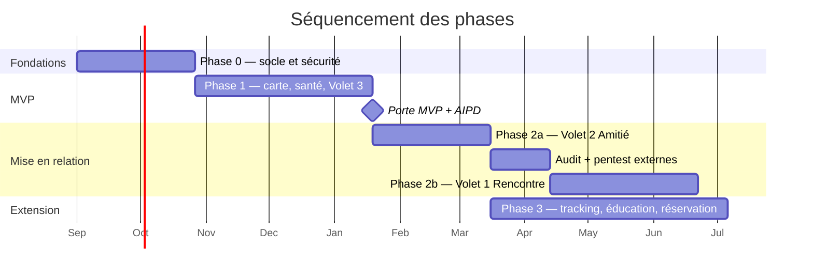

# K9 Global Solution — Plan de livraison par phases

> Répond à la section 5 du brief. Chaque phase a un **critère de sortie vérifiable**, pas une
> date. Les estimations en semaines supposent **deux développeurs à temps plein** (hypothèse
> N1) ; à un seul développeur, multiplier par 1,8 environ — pas par 2, le coût de coordination
> disparaissant en partie.

## Vue d'ensemble

Une remarque sur ce séquencement : **la Phase 3 démarre après la Phase 2a, pas après la
2b**. Le tracking, l'éducation et la réservation ne dépendent en rien du Volet 1 et ne
partagent avec lui aucune donnée. Les faire attendre l'audit du module de rencontre
immobiliserait des mois de valeur produit pour rien. C'est un écart au brief, qui les
plaçait après ; l'ordre proposé livre plus tôt sans toucher aux exigences de sécurité.

---

## Phase 0 — Fondations (≈ 8 semaines)

Aucun code métier. L'objectif est que tout ce qui viendra ensuite hérite d'un socle sûr.

**Contenu**

- Dépôt, branches protégées, commits signés, conventions, ADR.
- Terraform : trois environnements, réseau, **trois bases séparées avec rôles distincts**,
  instance dédiée `k9_dating` (créée vide dès maintenant — l'isolation se conçoit au début,
  pas après).
- CI/CD complet avec toutes les étapes de sécurité (épopée SEC-F).
- Keycloak, inscription, connexion, vérification d'e-mail, suppression de compte.
- Modèle de données socle : `users`, `user_consents`, `user_module_optin`, `dog_profiles`,
  `breeds`, `media`, `audit_log`, `outbox`.
- Écran de consentements granulaires, politique de confidentialité et CGU FR/DE/EN/LU.
- Squelette Flutter : navigation, internationalisation, thème, appels API authentifiés.
- Générateur de données synthétiques.

**Critère de sortie [GATE]**

1. Le test C08 passe : un compte témoin opt-in Volet 2 n'apparaît dans aucune découverte
   Volet 1 — alors même qu'aucun code de volet n'est encore écrit. La garantie est
   structurelle avant d'être fonctionnelle.
2. Le test A05 passe : `CREATE EXTENSION postgres_fdw` échoue sur les trois bases.
3. Le test A03 passe : `app_core` ne peut pas se connecter à `k9_dating`.
4. La CI casse effectivement sur un secret commité, une vulnérabilité haute, et un import
   croisé entre volets — les trois vérifiés par mise en échec volontaire.
5. Registre des traitements rédigé, DPA signés avec l'hébergeur.
6. Une restauration de sauvegarde a été réalisée et chronométrée.

**Ce qui n'est pas fait en Phase 0** : aucune carte, aucun profil public, aucune messagerie.

---

## Phase 1 — MVP (≈ 12 semaines)

Le premier produit utilisable. Volontairement centré sur les modules à faible risque
relationnel, ce qui permet de constituer une base d'utilisateurs et de roder la modération
avant d'ouvrir le moindre module de matching.

**Contenu**

- **Carte des lieux canins** : import OSM (avec attribution et séparation de source),
  ajout communautaire modéré, avis et photos, filtres par type et politique canine,
  recherche par proximité PostGIS.
- **Carnet de santé** : vaccins, vermifuges, poids, rendez-vous, rappels push, historique.
- **Volet 3 — Recherche de balade** : annonces (lieu de rendez-vous choisi parmi les
  `places`, créneau, niveau d'énergie), candidatures, balades collectives événementielles,
  groupes de quartier.
- **Premiers secours canins** en lecture seule et **hors ligne** : guide relu par un
  vétérinaire, checklist de trousse, contacts d'urgence, vétérinaires d'urgence proches.
  Ce module est peu coûteux, très différenciant, sans risque relationnel — et c'est le lien
  le plus naturel avec l'activité K9 existante.
- **Modération et DSA** : signalement, blocage, back-office, exposé des motifs, recours,
  pipeline média complet.
- Saga d'effacement, export de portabilité.

**Critère de sortie [GATE]**

1. Un signalement est traité en moins de 24 h sur un jeu de tests, avec exposé des motifs
   transmis et recours ouvert.
2. Aucune réponse d'API ne contient les coordonnées d'un tiers (test de triangulation
   automatisé, ticket G08).
3. Aucune photo publiée ne conserve ses EXIF (test sur une image portant des coordonnées GPS).
4. La saga d'effacement supprime effectivement dans les trois bases et produit ses accusés.
5. Le guide de premiers secours fonctionne en mode avion, sur les quatre langues.
6. Les fiches store (Data Safety, Privacy Manifest) correspondent au registre des traitements.

**Décision attendue avant la Phase 2a** : AIPD complète (G02). Elle est bloquante et prend
plusieurs semaines s'il faut consulter un conseil — à lancer pendant la Phase 1, pas après.

---

## Phase 2a — Volet 2 : Amitié (≈ 8 semaines)

Premier module de mise en relation. Il sert aussi de répétition générale pour le Volet 1 :
tout ce qui se révèle difficile ici (modération des messages, faux profils, harcèlement) le
sera davantage là-bas.

**Contenu**

- Base `k9_friendship` : projection de profil par outbox, découverte à proximité grossière,
  intérêt mutuel, conversations, messagerie modérée, blocage.
- Opt-in explicite, jamais activé par défaut, avec explication claire de la portée du blocage.
- **UX explicitement non romantique** : pas de swipe affectif, vocabulaire de rencontre
  interdit dans les libellés, les notifications et les textes des stores — vérifié par une
  revue de contenu, pas seulement par intention.
- Détection de coordonnées bancaires et de sortie de plateforme dans les messages.
- Alertes métier : aspiration de profils, comptes multiples, signalements convergents.

**Critère de sortie [GATE]**

1. AIPD validée.
2. Le test C08 passe toujours, désormais avec des données réelles dans `k9_friendship`.
3. Aucun code de matching n'est partagé — vérifié par le test d'architecture et par revue.
4. Le rythme de traitement de modération tient la charge réelle sur quatre semaines
   d'exploitation.

---

## Audit externe (≈ 4 semaines, calendaire)

Non négociable avant la Phase 2b (§5 du brief). Deux prestations distinctes :

- **Test d'intrusion** applicatif et mobile, incluant les tentatives de contournement de la
  vérification d'identité et de triangulation de position.
- **Audit d'isolation** : un tiers confirme par écrit qu'aucune requête croisée n'est
  possible entre les trois bases.

Les vulnérabilités critiques et hautes sont corrigées **et retestées**. Un rapport avec
correctifs non revérifiés ne franchit pas la porte.

---

## Phase 2b — Volet 1 : Rencontre (≈ 10 semaines, après audit)

**Ne démarre pas avant que les Phases 0, 1 et 2a soient validées et l'audit rendu.**

**Contenu**

- Intégration itsme / Veriff, avec verrou d'intégrité en base (D05) et **sans stockage de
  document**.
- Base `k9_dating` sur instance dédiée, code de matching entièrement séparé.
- Modération photo humaine systématique avant publication, classification d'âge apparent.
- Messagerie renforcée : aucun message possible sans vérification approuvée.
- Classification 18+ sur les stores, déclaration de contenu de rencontre.

**Critère de sortie [GATE]**

Les quatorze tickets de l'épopée SEC-D, sans exception, dont : vérification d'identité
opérationnelle, isolation auditée par un tiers, pentest externe avec correctifs revérifiés,
procédure pédopornographie écrite et validée juridiquement, AIPD refaite pour ce volet.

---

## Phase 3 — Extension (≈ 16 semaines, en parallèle à partir de la 2a)

- **Tracking sportif** : sessions GPS (pistage, mantrailing, cani-cross, cani-rando),
  statistiques de progression, export GPX avec troncature des extrémités, privé par défaut.
- **Éducation et dressage** : programmes, progression par chien, bibliothèque de contenus.
- **Hébergement et véhicules adaptés** : annuaire, mise en relation. **Sans encaissement
  dans un premier temps** (décision B3 du 8 août 2026 : aucun flux de paiement avant la
  Phase 3) — la réservation avec paiement est un projet en soi, qui déclenche les
  obligations de place de marché.
- **Passerelle K9 Experience Solution** : kits de premiers secours, aménagement de véhicules,
  formations. Naturellement rattachée au module Premiers secours livré en Phase 1.

---

## Ce qui n'est volontairement pas dans le plan

- **Une application web.** Aucune valeur au MVP, double le périmètre de sécurité.
- **Tout flux de paiement avant la Phase 3** — tranché le 8 août 2026. Sans base
  d'utilisateurs il n'y a personne à convertir, et le paiement ajoute des obligations
  réglementaires lourdes.
- **Les microservices.** À reconsidérer si un module devient un goulot d'étranglement mesuré,
  jamais par anticipation.
- **Le chiffrement de bout en bout des messages.** Incompatible avec l'obligation de
  modération (`01-architecture.md` §9) — arbitrage assumé, à écrire dans la politique de
  confidentialité.
- **Un modèle d'IA de recommandation de matching.** Un profilage automatisé de mise en
  relation ajouterait des obligations de transparence et un risque de biais, pour un gain nul
  à faible volume. Tri par proximité, activité récente et compatibilité déclarée des chiens.

---

## Risques principaux du plan

| Risque | Probabilité | Impact | Atténuation |
|---|---|---|---|
| Marché de départ trop étroit (Grande Région) : un réseau social sans densité locale ne fonctionne pas | **élevée** | élevé | Lancer par ville (Luxembourg-Ville d'abord), pas par pays ; la carte et le carnet de santé ont de la valeur **sans** effet de réseau — c'est pourquoi ils sont en Phase 1 |
| Coût de modération sous-estimé | élevée | élevé | Automatisation d'abord, Volet 1 en dernier, prestataire de modération externalisée budgété avant la Phase 2b |
| Audit externe révélant un défaut d'isolation structurel | moyenne | très élevé | Concevoir l'isolation en Phase 0 et la tester en continu, plutôt que la découvrir à l'audit |
| Refus App Store (localisation en arrière-plan, module de rencontre) | moyenne | moyen | Préparer les justificatifs et la vidéo de démonstration dès la Phase 1 ; soumettre une première version sans Volet 1 pour établir un historique |
| Onze modules pour une petite équipe : dispersion | **élevée** | élevé | C'est le risque le plus sous-estimé du brief. Les portes de phase servent aussi à cela : ne pas ouvrir un module tant que le précédent n'est pas tenu |
| Contenu (premiers secours, dressage) non produit à temps | moyenne | moyen | Le contenu est un chemin critique parallèle au code ; démarrer la relecture vétérinaire dès la Phase 0 |
